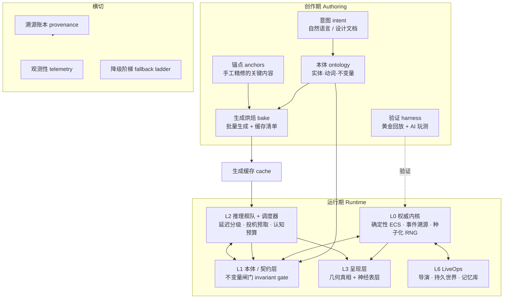

# 基于 AI 的游戏引擎会是什么样子？

> 一份架构设计文档 · 基线日期 2026-09-16
> 工作区：`meter` · 状态：设计提案（design proposal），非实现

---

## 0. 摘要

先说结论，避免读者读到最后才发现方向不对。

**"基于 AI 的游戏引擎"不是一个东西，而是三个完全不同的东西。** 把它们混为一谈是当前这个词最大的问题：

| 形态 | 产物 | 时间 | 现状 |
|---|---|---|---|
| **① AI 辅助引擎** | AI 在**工具链**里（编辑器 AI、资产生成、代码补全） | 2023– | 已在发货，价值真实但有限 |
| **② AI 增强引擎** | 确定性内核 + 生成式外围（运行时智能体、混合神经渲染、语义化内容） | 2026– | **本文的主题**，可工程化，是真正的答案 |
| **③ AI 即引擎** | 世界模型就是引擎，模型同时充当渲染器、物理与逻辑 | 2025– | 是**新媒介**，不是新引擎 |

本文的核心论点只有一句：

> **游戏引擎的本质不是"渲染器 + 物理"，而是"世界真相的权威持有者"。**
> 因此"AI 引擎"的全部架构，都从一个问题推导出来：**谁拥有真相？**

由此得出全文的中心设计原则（后文 §5.1 展开）：

> **模型无状态，内核是唯一写者（Models are stateless; the kernel is the sole writer）。**
> 模型只能"提议"，内核负责"校验—具现化—提交"。内核是想象力的类型系统。

以及一个可能反直觉的商业结论（§5.4）：

> **生成式内容必须"烘焙优先、在线为辅"。**
> 所有玩家都会看到的内容在**创作期**批量生成并随包发布（边际成本 ≈ 0）；
> 只有必须**针对个体玩家响应**的内容（对话、难度自适应、导演调度）才留在**运行时**——
> 而那一层是文本量级的，是今天唯一算得过来账的层。

最后，对"AI 会不会取代游戏引擎"的判断（§8）：**不会取代，会成为引擎的一个子系统**——就像物理引擎（2000s）、网络同步（2005–2015）、光线追踪（2018–）先后成为子系统一样。但这个子系统足够大，它会重写"内容是怎么做出来的"和"世界是如何持久的"这两件事。

---

## 1. 先把问题问清楚

### 1.1 传统引擎押的注

一个传统引擎（Unreal / Unity / Godot / 自研）本质上是一个**手工编写的模拟器 + 手工编写的内容管线**。它的架构隐含了一个赌注：

> 昂贵的、模糊的、需要品味的部分（世界长什么样、下一步发生什么、这个角色怎么说话），
> 由**人类在创作期**决定，**冻结成数据**；引擎的职责只是以 60Hz **确定性地重放**这份冻结的意图。

于是引擎的每一层都在为这个赌注服务：

- **资源管线**：把美术的意图编译成 GPU 可消费的格式（烘焙光照、压缩贴图、合并网格）。烘焙（bake）是关键词——**把昂贵的计算从运行期挪到创作期**。
- **ECS / 场景图**：把设计意图编码成离散、可序列化、可复制（replicate）的状态。
- **确定性物理 + 固定步长**：让"同样的输入产生同样的结果"成为系统的公理，这是存档、回放、网络同步、反作弊的共同地基。
- **脚本 / 蓝图**：让设计师能表达规则，同时不破坏确定性。

### 1.2 AI 引擎把这个赌注反过来了

> 昂贵的部分**在运行期由模型计算**，引擎的职责变成**在模型生成表层的同时，维持一个连贯、持久、可交互的世界状态**。

这不是"给引擎加个 AI 插件"。这是把引擎的中心从"重放意图"搬到"**约束生成**"。两者的架构差异，比 2D 引擎到 3D 引擎的差异还大。

### 1.3 判断标准：谁拥有真相

我建议用一个单一标准来区分"真 AI 引擎"和"贴了 AI 的传统引擎"：

> **当所有模型都被拔掉电源时，游戏是否还能运行？**

- 能，且退化到可玩的"低保真模式" → 这是一个**AI 增强引擎**（形态②）。
- 不能，画面和行为全部消失 → 这是**AI 即引擎**（形态③），即世界模型。

这个测试看起来朴素，但它直接决定了一整套架构（§5.3 降级阶梯）。**形态②必须通过这个测试；这是它可发货的前提。**

---

## 2. 现状切片（2026-09）

### 2.1 形态③：世界模型路线（直接核实的一手数据）

这一支的主张最激进：**不要引擎，用模型直接生成可交互的世界。**

| 系统 | 时间 | 已核实的硬指标 | 来源 |
|---|---|---|---|
| **Genie 1** (DeepMind) | 2024-02-23 | **11B 参数**；从**无标注互联网视频**无监督训练；可用文本/图像/照片/草图提示；**逐帧动作可控**；含时空视频分词器 + 自回归动力学模型 + **潜在动作模型** | [arXiv:2402.15391](https://arxiv.org/abs/2402.15391) |
| **GameNGen** (DeepMind) | 2024-08-27（v2 2025-04-24） | **单块 TPU 上 20 FPS**；下一帧预测 **PSNR 29.4**（约等于有损 JPEG）；**可稳定维持多分钟**自回归生成；人类评分者区分"真 DOOM"与"模拟"仅**略好于随机**；两阶段训练（RL 智能体试玩录制 → 扩散模型学下一帧）；ICLR 2025 | [arXiv:2408.14837](https://arxiv.org/abs/2408.14837) |
| **Genie 3** (DeepMind) | 2025-08-05 发布 | 官方定位为"世界模型的新前沿"，用简单文本描述生成**照片级真实**的可交互环境；DeepMind 官方模型页列为 "World models & physical AI" 类别下模型 | [deepmind.google/blog/genie-3-a-new-frontier-for-world-models](https://deepmind.google/blog/genie-3-a-new-frontier-for-world-models/) |
| **Project Genie** | 实验原型 | 官方描述："让用户创建并探索无限多样世界的实验性原型" | [labs.google/projectgenie](https://labs.google/projectgenie) |
| **SIMA 2** (DeepMind) | 2025 年后 | 官方定位："在虚拟 3D 世界中与你一起玩、一起推理、一起学习的智能体" | [deepmind.google/blog/sima-2-…](https://deepmind.google/blog/sima-2-an-agent-that-plays-reasons-and-learns-with-you-in-virtual-3d-worlds/) |

**这些数字说明了什么。** 请把 GameNGen 那一行读三遍：

> 一个 **1993 年**的游戏（DOOM），在**一块专用加速器**上，以 **20 FPS**、**约等于有损 JPEG 的画质**，生成"多分钟"的稳定交互。
> 而同一款 DOOM，今天在一块 **5 美元的微控制器**上就能以数百 FPS 光栅化渲染。

这就是 §3.2 那条经济学约束的实证版本。**它不是"还差一点"，而是差了若干个数量级，且成本归属结构完全不同**——传统渲染把每帧成本放在玩家显卡上（边际成本为零），生成式把每帧成本放在运营方的加速器上。

Genie 1 的 **11B 参数**同样值得注意：为了生成一个低分辨率可交互环境，需要 110 亿参数的模型。这类模型放进消费级显卡的显存里、还要同时渲染其他一切，在今天是不现实的。

> **本节标记为"未取得原文验证"的说法**：Genie 3 常被引用的具体规格（如 720p 分辨率、24 FPS、数分钟一致性窗口）在本次核查中**未能从官方原文取得**（deepmind.google 的相关页面在此网络环境下多次抓取失败）。本文不将其作为论据使用。

### 2.2 形态①②：商业引擎与平台的 AI 化（[A] 与 [R]）

**要看清这一块，先立一个分类。** 所有的 AI 功能只有两类，而这个区分比任何厂商名称都重要：

| 标记 | 含义 | 特征 |
|---|---|---|
| **[A] 创作期（authoring）** | 离线、开发时、由人审阅后落盘 | 成本被开发预算摊薄，**边际成本 ≈ 0**，不承担运行时风险 |
| **[R] 运行期（runtime）** | 每帧 / 每交互，在玩家机器或运营方服务器上 | 承担延迟、确定性、可用性风险，**边际成本不归零** |

**结论先给：今天所有主流引擎里的生成式 AI，几乎全部是 [A]。唯一成熟起来的 [R] 类工作是"神经渲染与推理"，而不是"神经生成"。**

#### Unity — 全部生成式能力都是编辑器内的 [A]

当前编辑器为 **Unity 6.6（6000.6）**，官方手册的"Unity's AI"页面只列出**两根支柱**：编辑器内 AI 助手，与 Sentis。

- **Assistant**（`com.unity.ai.assistant`，包版本 **2.19.0-pre.2**）：三种模式 **Ask（只读）/ Plan（只写计划，需批准后才实施）/ Agent（读写，受权限门控）**。能生成精灵图、贴图、材质、立方体贴图、3D 物体、地形层、音效片段、动画片段；能通过截图与检查点自动化编辑器操作；能分析 Profiler；支持 MCP、AI 网关、skills 与外部智能体。**计费方式是 credits**——付费用户每月配额 + 可购买，分 **Unity Lite / Default / Ultra** 三档，官方明说 Ultra 消耗 credits "显著更多"。
- **Sentis / Inference Engine**（`com.unity.ai.inference`，显示名 **"Sentis 2.6.1"**）：支持 ONNX opset 7–25、LiteRT、PyTorch Core-ATen IR，可在设备端 CPU/GPU **实时**跑导入的模型。注意——这是**[R] 通用神经网络推理，不是生成式**。它的命名还反复横跳过（2.1.3 文档说"Sentis 现更名为 Inference Engine"，2.6.1 文档又说 2.4 起从 Inference Engine 改回 Sentis），这个细节本身很能说明团队对这个定位的犹豫。
- **Behavior**（`com.unity.behavior` 1.0.16，免费）是**可视化的行为图工具**，用于 NPC 与玩法逻辑——**不是生成式的，是人手写的**。这一点值得注意：Unity 在 NPC 行为上的官方答案仍然是**确定性的行为树**，不是 LLM。
- **Muse 这个名字基本消失了**：Unity 6.6 的已发布包列表里**没有任何 `com.unity.muse.*` 包**，存活下来的是 Assistant 里的 "Generators"。具体退役时间**未核实**。

#### Unreal Engine — 神经渲染是 [R]，但仍是 Beta / Experimental

**UE 5.8 于 2026-06-23 发布**，随后是"通往 UE6 之路"（2026-06-22），统一 UE 与 UEFN。

- **Neural Network Engine（NNE）— Beta**：对多种神经网络运行时的统一 API，明确面向"**用实时推理增强游戏**"，同时也用于编辑器侧资产操作。包含 **NNE Denoiser**（路径追踪降噪，Intel OIDN 或自定义模型）、**NFOR** 时空降噪、**Neural Post Processing**、**ML Deformer**、**ML Cloth**。
- **Neural Post Processing — Experimental**：启用 Neural Rendering 插件，ONNX → `NNE Model Data` → `Neural Profile`，在材质编辑器里接 Neural Input/Output 节点；运行时后端 `NNERuntimeORTDml`（DirectML）/ `NNERuntimeRDGHlsl`。用途是**风格迁移**（AnimeGAN、CartoonGAN、Pix2Pix、CycleGAN）、ShadeSketch、神经色调映射、分割——**都是渲染，不是生成**。
- **ML Deformer**：离线训练（Maya 插件，约 15,000 个随机姿态，50–100 GB alembic）→ **Neural Morph Model**（默认）/ Nearest Neighbor Model（布料）/ Vertex Delta Model（**仅作示例，"不应在生产中使用"**）；随后在运行时用 morph target 近似网格。[A]→[R]。
- **两个必须点名的否定性事实**：**Nanite 与 Lumen 都不是神经的**（未找到其神经渲染路径）；**Epic 对生成式 AI 的明确立场未能取得一手来源**。而 Epic 对 NNE 与 Neural Post Processing 的官方措辞仍是"**发货时请谨慎**"——一个市值级别的引擎厂商，对自己已有的神经功能都是这个态度，这是对当前成熟度很诚实的评价。

#### Godot — 官方零 AI

Godot 基金会的项目愿景声明（2026-06-23 修订）**完全没提 AI**，并明确写着："**专注且务实……其余一切，插件与扩展才是答案。**" Godot 4.7 的发布说明（HDR、`AreaLight3D`、Asset Store、GABE、2D 场景画笔）**不含任何 AI 功能**，4.8 在开发中。

生态里**全是第三方**，且**全部是 [A]**：`godot-ai-assistant-hub`（307★）、`godot-mcp`（162★）、`Godot_AI`（54★）、`ai_assistant_for_godot`（35★）、以及 `godogen`（**6,919★**，用 Claude Code / Codex 做自主 Godot 开发）。

> `godogen` 的星数很说明问题：**社区对"AI 帮我做游戏"的热情，与引擎官方对"AI 进引擎"的冷淡，形成了鲜明对比。** 需求是真实的，但它落在工具链层面，而不是引擎内核层面。

#### Roblox — Cube 是 [A]；运行时路径很窄

- **Assistant**（Studio 智能体）带 **Planning Mode 与显式批准门控**，官方说明计划"**绝不自动执行**"；**Code Assist 只是脚本编辑器里的自动补全**，不是智能体；Texture Generator 是 beta，Material Generator 已发货；Studio 的 **MCP server** 暴露网格/程序化生成、Luau 执行与一个 `playtest` 子智能体。
- **Cube 3D**：v0.1（2025-03）→ v0.5（2025-07）→ **CubePart（2026-05，SIGGRAPH 2026，[arXiv:2605.28763](https://arxiv.org/abs/2605.28763)）**。但**许可证不宽松**：名为 "Cube3D Research-Only RAIL-MS License"，**仅限学术与研究用途**。
- **运行时的真相在这里**：`GenerationService` 号称"由 Cube 3D 基础模型驱动"，但 `GenerateModelAsync` **只接受封闭的 schema（`Car5`、`Body1`）**，且生成结果**复制给所有玩家**；`GenerateMeshAsync` 已被弃用。也就是说，**Roblox 的"运行时生成"是一个异步的、限流的、产出 `MeshPart` 的任务，而不是逐帧渲染**——而且它生成的是**内容**，不是**画面**。

#### NVIDIA — 唯一清晰的 [R] 故事，但内容是"渲染与推理"

- **ACE**：面向语音、智能、动画的云端与端侧模型；UE5 插件覆盖 5.4–5.7（Audio2Face-3D、ASR、LLM、TTS）；**Game Agent SDK（Beta）**；模型含 Nemotron Nano 4B/9B、Qwen3.5-4B/8B、Chatterbox TTS。已发货合作：《全面战争：法老》顾问、《PUBG》Co-Player Characters、《inZOI》Smart Zois、《MIR5》Boss、《Dead Meat》。
- **NVIGI SDK 1.7**：进程内 C++ 推理，走 **CUDA in Graphics**；后端 TensorRT / ONNX Runtime / Llama.cpp。
- **RTXNS（RTX Neural Shading / 神经着色器）**：基于 Slang，训练小网络来**表示一个着色器或一张贴图**，然后与常规渲染一起推理（DirectX Agility SDK 预览版或 Vulkan `VK_NV_cooperative_vector`）。**仍处于预览级**。
- **DLSS 4 / 4.5**：DLSS 4 = **多帧生成（MFG，每渲染 1 帧最多生成 5 帧**，RTX 50 / Blackwell Tensor Core）+ transformer 超分；**DLSS 4.5 = 动态 MFG + 第二代 transformer，支持 6× 多帧生成**；Ray Reconstruction 取代手调降噪器。UE 插件 v8.8.0 覆盖 5.5–5.8（2026-09-15）。

> **这里有一个值得深思的对比。** NVIDIA 的 [R] 神经技术**全部是"用 AI 让传统渲染更便宜或更好看"**——超分、插帧、降噪、着色器近似。**没有一项是"用 AI 替代传统渲染"。** 插帧尤其值得注意：它承认了"渲染不够快"这件事，然后**用生成来补足帧率**，而不是生成整个世界。**这是务实派赢得的方式——不是取代管线，而是在管线里插入可降级的加速器。**

#### Microsoft / Xbox — Muse 是"最著名的 AI 玩法模型"，但它从未发货

这是本文**最重要的一则警示案例**。

- **Muse**（2025-02-19 公布）是微软研究院 **WHAM（世界与人类动作模型）** 的名字，与 Xbox Game Studios 的 **Ninja Theory** 合作，在《Bleeding Edge》上训练，能建模 3D 物理并对手柄输入做反应。论文发表于 ***Nature* 638:656–663**（DOI 10.1038/s41586-025-08600-3）。最大模型是 **1.6B 参数** transformer（540 个图像 token，300×180）；变体从 15M 到 894M；训练用了**约 50 万场对局**、覆盖全部七张地图。权重与评测数据公开在 Azure AI Foundry 与 Hugging Face（`microsoft/wham`）；交付物中有一个"**WHAM Demonstrator**"，被描述为**概念原型**。
- 官方定位是**玩法创意与前期预研 → [A]**。
- **而从 2025 年 2 月到现在，没有任何 Muse 功能发货。** Xbox Wire 的 AI 标签下**只有那一篇**帖子。2026 年的重构把 AI 转向**芯片与渲染**——与 AMD 合作的 **Project Helix**（"把智能直接放进图形与计算管线"，FSR Next，alpha 硬件 2027），**完全没提 Muse**；而 2026 年 7 月的"Resetting Xbox"博文把 **Ninja Theory——Muse 的合作方——划入了新的所有权**，同样**没提 Muse**。
- **Gaming Copilot** 是唯一真正落地的：2025-03-13 作为概念公布 → 2025-05-28 移动端 beta → 2025-08-06 Game Bar Insiders → **2025-09-18 PC 与 Xbox 移动端 Gaming Copilot（Beta）** → 2025-11 移动端应用。它是**面向玩家的助手**，属于 [R]，但**不是生成式渲染**。

> **读一遍 Muse 的时间线**：2025 年 2 月，全世界媒体称它为"AI 游戏引擎的黎明"；随后是**一篇帖子、一个概念原型、零个发货功能**；18 个月后，合作工作室被挪出了 Xbox。
> **这是对"AI 即引擎"路线最有力的一次现实检验**，而且它来自一家不缺钱、不缺算力、不缺人才的公司。

#### 中国厂商 — 腾讯给了本文论据，网易给了本文一个已发货的反例

**腾讯：两条并行路线，而两条都在把生成推向创作期。** 这一点比我最初以为的更微妙，也更有说服力。

**(a) [A] 创作期：Hunyuan3D**

2.0（2025-01-21，DiT 形状 1.1B + Paint 纹理 1.3B）→ 2mini / 2mv（03-18）→ Turbo（03-19）→ Paint-v2-0-Turbo（04-01）→ **2.1（2025-06-13）：自称"首个生产就绪的 3D 资产生成模型"，完全开源并附训练代码**（[arXiv:2506.15442](https://arxiv.org/abs/2506.15442)）→ **2.5 只有技术报告**（LATTICE 形状模型，最高 10B 参数，[arXiv:2506.16504](https://arxiv.org/abs/2506.16504)，2025-06-19），**没有公开仓库或权重** → 后续 Hunyuan3D-Omni 与 -Part（2025-09）、Buffalo 1.0（2026-08）。**显存门槛：形状 6 GB，形状+纹理 16 GB。**

> **一处必须纠正的错误，而且它本身就是个教训。** 网络上广泛流传的"**Hunyuan3D 3.0**"——**它不存在**：`Hunyuan3D-3.0` 仓库返回 404，组织内搜索得到 11 个 Hunyuan3D 仓库，**没有一个是 3.0**。（本文初稿曾依据一篇论文把它当作"作为第三方骨干被引用"而采信，本次核查后撤回。）
> 连一个版本号都会在传播中被凭空造出来。**这就是本文坚持给每条事实标注来源等级的理由。**

**(b) [A] 创作期：HY-World —— 本文最关键的外部论据**

HunyuanWorld 1.0（2025-07-26，[arXiv:2507.21809](https://arxiv.org/abs/2507.21809)）→ 1.0-lite → Voyager → FlashWorld（3DGS，5–10 秒）→ 1.1 WorldMirror → **HY-World 2.0（2026-04-16，[arXiv:2604.14268](https://arxiv.org/abs/2604.14268)）** → 2.1（2026-07）。

HY-World 2.0 输出的是**真正的 3D 资产（网格 / 3DGS / 点云），可直接导入 Unity、Unreal 与 Isaac Sim**。而在腾讯**自己的对比表**里，他们把视频世界模型（**Genie 3**、Cosmos、HY-World 1.5）列为"**需要逐帧推理；高延迟**"，并在自己这一侧写下：

> **"一次性生成；渲染成本 ≈ 0。"**

**请体会这件事的分量**：一家拥有《王者荣耀》和《和平精英》的公司，在官方仓库的 README 里明确选择站在"创作期生成"一边——理由正是本文 §3.2 独立推导出的那条经济学约束。**这不是我说服了你，这是腾讯自己算完了账。**

**(c) [R] 但腾讯同时也有运行时生成路线——而它恰好又一次验证了同一条约束**

这一点必须写清楚，否则上面的论证就过头了：

- **HY-WorldPlay / HunyuanWorld 1.5**（2025-12-17 开源）：号称实时交互世界模型，**流式 24 FPS**——但需要 **28–72 GB 显存**。
- **Hunyuan-GameCraft-1.0**（2025-08-14）：生成可交互游戏视频，需要 **8×H20/H800**，且**每 33 帧才接受一个动作**（25 FPS）。
- GameCraft-2 1.0 是 14B MoE（[arXiv:2511.23429](https://arxiv.org/abs/2511.23429)）。

> **这是演示，不是可玩产品。** 所以准确的表述**不是**"腾讯反对运行时生成"，而是：
> **腾讯两条路线都在做，而这两条路线开出的硬件账单——28–72 GB 显存、8 张 H20——正是 §3.2 那条约束的另一种写法。** 一个 40 小时游戏如果要靠 8 卡服务器服务一个玩家，商业模式从一开始就不成立。

**(d) [R] 已发货的运行时 AI——但它是 RL，不是生成式**

腾讯 AI Lab 的 `hok_env` 是用强化学习驱动**已发货的《王者荣耀》游戏内核**的开放环境（[arXiv:2209.08483](https://arxiv.org/abs/2209.08483)）；JueWu-SL 达到人类水平的 MOBA 对战水平（[arXiv:2011.12582](https://arxiv.org/abs/2011.12582)）。

**注意这条的区别**：这是**[R] 运行时 AI，但是它不是生成式的**——它是策略学习，输出的是离散动作，**天然可校验、可回放、可复现**。这与本文 §5.1 的主张完全一致：**能在运行时安全运行的 AI，是那些输出受限、可被内核校验的 AI。**

**(e) 未取得一手来源的**

腾讯 **GameGen / 元梦（Yuanmeng）"AI 原生引擎"**——GitHub 搜索 **0 结果**，组织仓库列表中无此物。**又一个"广为流传但没有一手来源"的说法。**

#### 网易：唯一可核实的"已发货运行时 AI"中国厂商

- 伏羲实验室**自述的已发货运行时游戏 AI**包括：《逆水寒》的虚拟智能体 NPC **"叶问舟"**、《鬼话》的对话角色 **"Smart Child"**、以及《热血篮球》的 MA-RL 3v3 机器人（[leihuo.163.com](https://leihuo.163.com/en/support.html)）。
- **[A] 侧**是**绘梦天工**（表情捕捉、飘带解算、舞蹈生成、AI 配音）。
- 《逆水寒》手游于 **2023-06-30** 在中国上线时**即带 AI 生成对话**——这是"LLM 对话进已发货商业游戏"最早的可核实案例之一。
- **未核实**："玉魂"、"NetEase Matrix"——**未找到任何来源**。

> 网易这条很值得琢磨：它是**反例，也是支持**。反例在于——**运行时 AI 对话确实已经在商业游戏里发货了，而且早于 2023 年**。支持在于——**它发货的形态是"少数特定 NPC 的对话"，而不是"整个引擎"。** 这正是本文对形态②的定位。

#### 米哈游与"AI 原生引擎"宣称：基本无可核实内容

- **米哈游**：无官方 GitHub 组织（`api.github.com/orgs/miHoYo/repos` → 404；`HoYoverse` → `public_repos: 0`）；arXiv 检索 `all:"miHoYo"` **0 篇**；`research.mihoyo.com` 不解析。Anuttacon 的 "AI Soul Casting" 与《Whispers from the Star》是真的，但其站点**未声明与米哈游有任何关系**。
- **"Mirage" / Dynamics Lab**：被第三方描述为"世界首个实时生成式世界引擎"/"AI 原生 UGC 游戏引擎"；`mirage2.org` 宣传 "Mirage 2"（图片 → 30–60 秒生成可交互 3D 世界、"实时多人"）。但 **`dynamicslab.ai` 是一个空的 JS 落地页**（sitemap 只有 `/lander`），`blog.dynamicslab.ai` 不解析。**归入"营销宣称、未产品化"。**
- **Kimi / Moonshot**：宣称进一步降级为**一次代码生成演示**。真实情况是：独立开发者 a327ex 让 Kimi K3 完成**他自己的 "Anchor 3D 任务"**——把他自己的 C+Lua 2D 引擎移植到 3D。**"Anchor" 是这位开发者的引擎，不是 Kimi 的**；产物是一个浏览器 playground；**没有运行时 AI，没有已发货引擎，也不是多人游戏**。

#### 小结：这张表就是本文论点的实证

| 引擎 / 平台 | 生成式 AI 的定位 | 神经 [R] 的成熟度 |
|---|---|---|
| **Unity 6.6** | 全部在编辑器内（Assistant，credits 计费、需批准） | 无生成式运行时路径；Sentis 是通用推理 |
| **Unreal 5.8** | 编辑器侧 + NNE 通用推理 | **Beta / Experimental**，官方称"发货请谨慎" |
| **Godot 4.7** | **无官方 AI**，仅第三方工具 | 无 |
| **Roblox** | Cube（**仅研究许可**）+ Assistant | 异步、限流、**封闭 schema**的网格生成 |
| **NVIDIA** | — | **唯一成熟**：DLSS 4/4.5、RTXNS、ACE/NVIGI |
| **Xbox** | Muse **从未发货** | 转向芯片（Project Helix，2027） |
| **腾讯** | Hunyuan3D / HY-World，**自己的对比表主张创作期生成** | 运行时路线存在但**研究级、硬件残暴**（28–72 GB 显存 / 8×H20）；已发货的 [R] 是 **RL 而非生成式** |
| **网易** | 绘梦天工（[A] 美术工具） | **唯一可核实的已发货运行时 AI 对话**：《逆水寒》叶问舟、《鬼话》Smart Child、《热血篮球》MA-RL 机器人 |

> **结论：今天没有任何主流引擎发货逐帧的生成式渲染。** 唯一成熟的运行时神经工作是**加速与近似**（升采样、插帧、降噪、着色器近似），而不是**替代**。生成式 AI 全部退守在创作期——这不是巧合，是 §3.2 那条约束在商业上的显现。
>
> 而腾讯自己那条运行时生成路线开出的账单（28–72 GB 显存、8 张 H20），**恰好是同一约束的另一种写法**：一个 40 小时的游戏若要靠 8 卡服务器服务单个玩家，商业模式从一开始就不成立。

### 2.3 运行时智能体

这一支是**唯一真正活在运行时的生成式 AI**，因此也是本文架构主张最直接的实证来源。

**（1）奠基工作。**

- **Generative Agents**（Stanford，[arXiv:2304.03442](https://arxiv.org/abs/2304.03442)，2023-04）：LLM + **记忆流**（以自然语言记录经历），随时间合成为更高层的 **reflections**，再动态检索以驱动行为规划。25 个智能体在类《模拟人生》沙盒里，一个关于"情人节派对"的种子念头传播出了邀请、新结识与协调到场。消融实验显示观察、规划、反思三者各自都是关键。
- **Voyager**（[arXiv:2305.16291](https://arxiv.org/abs/2305.16291)，2023-05）：Minecraft 中首个 LLM 驱动的终身学习智能体。三件套：自动课程、**不断增长的、可执行代码形式的技能库**、以及用环境反馈与执行错误做迭代提示。比基线多 3.3× 独特物品、2.3× 移动距离、技术树里程碑最快 15.3×。注意这里的信号：**技能以代码形式积累**，而不是以文本形式。
- **AI Dungeon** 至今仍在商业运营（Latitude，© 2026），是最长寿的 LLM 原生游戏产品，它的定价模型本身就是一份公开的运营数据：1 token ≈ 4 字符；上下文窗口约 4k（免费）到 32k（顶配）；月费 $14.99–$99.99；**更大上下文按 1 credit/动作 计费**（[aidungeon.com](https://aidungeon.com/)、[帮助文档](https://help.aidungeon.com/memberships-benefits)）。

  这个细节值得单独记住：**context 长度是第一成本驱动因子，以至于必须作为计费项单独标价。** 这直接印证了本文 §9 开放问题 7（记忆与个性化的 prompt 膨胀）。

**（2）商业中间件的现状：一个正在收敛的市场。**

| 厂商 | 实际在卖什么 | 关键事实 |
|---|---|---|
| **Inworld AI** | **已经不是 NPC 中间件了**——转向计量式**推理服务** | TTS-2 $25 / 1M 字符，TTS-2 Flash $15 / 1M，STT-1 $0.15/小时，LLM"按成本价"经 220+ 模型路由器；订阅 $25–$1,500/月；企业版 TTS 低至 $5 / 1M。文档站点存在 `character-studio-deprecation` 页面。首字节音频延迟 **20 ms P90**（Flash）/ 100 ms（TTS-2） · [inworld.ai/pricing](https://inworld.ai/pricing)、[延迟文档](https://docs.inworld.ai/tts/best-practices/latency) |
| **NVIDIA ACE** | **SDK / 模型套件，不是按 NPC 计费的服务**——靠卖硬件变现 | UE5 插件（ASR、LLM、TTS、Audio2Face-3D，MIT 许可）、C/C++ **Game Agent SDK（Beta）**、以及走 Compute-in-Graphics 的端侧推理 SDK **NVIGI**。已公开的落地：《全面战争：法老》端侧 SLM 顾问、KRAFTON《PUBG》Co-Player Characters、《inZOI》Smart Zois、Wemade《MIR5》AI Boss · [developer.nvidia.com/ace-for-games](https://developer.nvidia.com/ace-for-games) |
| **Convai** | 带长期记忆、护栏、"State of Mind" 的对话角色 + Unity/Unreal 插件 | 定价与延迟：**未取得一手数据**（定价页是 JS 空壳） · [convai.com](https://convai.com/) |
| **Anuttacon**（新加坡） | AI 角色游戏《Whispers from the Star》，口号"AI Soul Casting" | [anuttacon.com](https://www.anuttacon.com/) |
| **NetEase 伏羲** | 公开站点已转向工业机器人与 AOP 智能体平台，**不再是游戏 NPC 中间件** | [fuxi.163.com](https://fuxi.163.com/) |

**这里有一个比任何技术细节都重要的商业信号**：**这家最知名的"AI NPC 中间件"公司退出了 NPC 中间件业务，改卖 token 计量。** 结合"没有任何厂商公布 per-NPC-per-hour 价格"这一事实，可以合理推断：**"AI NPC"作为独立中间件层的商业模式尚未被验证**，它更像是模型服务的一个应用场景，而不是一个可独立定价的产品层。

**（3）SIMA 1 / SIMA 2：值得单独看，因为它是"研究"而不是"产品"。**

- **SIMA 1**（[arXiv:2404.10179](https://arxiv.org/abs/2404.10179)，2024-03-13）：刻意采用**类人接口**——输入是画面观察 + 自由语言，输出是键盘鼠标动作——覆盖研究环境**与商业游戏**。
- **SIMA 2**（博客 2025-11-13；论文 [arXiv:2512.04797](https://arxiv.org/abs/2512.04797)，2025-12-04）：建立在 **Gemini 基础模型**之上，是一次质变——不再只是执行简单指令，而是"**扮演交互伙伴**"，对高层目标做推理、**与用户对话**、并接受语言**与图像**两种形式的指令；"**大幅缩小了与人类表现的差距**"，能稳健泛化到未见环境，并展示了开放式自我提升（**Gemini 同时生成任务与奖励**，使 SIMA 2 能在新环境中从零学技能）。

**但两者都是研究，不是产品**——本次检索未找到任何商业 SDK、定价或游戏集成。

> **一个关键的架构对照**：SIMA 2 感知的是**像素**；而今天真正发货的商业 NPC 吃的是**游戏 API 的结构化状态**。这两条路线正在收敛，但今天仍不是同一个产品。而本文 §4 选择的是后者——**因为它可校验**。

**（4）实践中的架构：NVIDIA Game Agent SDK 暴露了真实工程原语。**

这是本次研究里**最有工程价值**的部分，因为它把"世界真相 vs 生成层"的分离落到了具体的 API 上（[agent-deep-dive.md](https://raw.githubusercontent.com/NVIDIA/game-agent-sdk/main/docs/sphinx/source/agent-deep-dive.md)）：

| 原语 | 作用 | 对应本文的哪一层 |
|---|---|---|
| **transient messages** | 注入下一次 prompt 用完即弃，用于一次性引导（"两句话回答"、"输出 JSON"），**不污染历史** | L2 调度器 |
| **redacted messages** | 内容保留但渲染为 `[REDACTED]`，用于模型只需消费一次的大型工具结果 | §5.2 认知预算 |
| **preamble** | 持久前缀，能**挺过 HistoryWindow 老化**并每次重新发出，用于"待办操作摘要" | §3.4 抗漂移 |
| **HistoryWindow + `ace_agentGetWindowStart`** | 智能体**不自动摘要**；由应用监听窗口起点，自己摘要即将掉出的内容 | §5.2（成本即上下文长度） |
| **cancellation + `rollback` 标志** | 线程安全，可抹掉最后一条用户消息之后的一切——**让玩家中途打断 NPC** | §5.1 提交语义 |
| **skip-inference + `"in-progress"` 占位** | 放行 fire-and-forget 工具，同时避免孤儿工具调用 | L2 异步 |

**检索（RAG）的做法**同样具体（[rag-building-a-database.md](https://raw.githubusercontent.com/NVIDIA/game-agent-sdk/main/docs/sphinx/source/rag-building-a-database.md)）：词法（BM25）或语义向量库，**1024 token 分块**；`doc/` 全文索引，`kv/` 则是 Q:/A: 对——**只嵌入问题，返回完整答案**；按章节对齐的分块会产出**图边**连接相关章节。

其中最有启发的是它的**数据准备规则**，本质上是"**让游戏状态学会说人话**"：
- 把内部 ID 解析成可读值；
- 把编码值翻译成自然语言（`1` → `yes`）；
- 把关系写成**句子**（"建筑 X 允许招募单位 Y"），而不是键值列表；
- 预计算反向查询用的摘要记录。

**这其实是一条重要的设计原则**：AI 引擎里，**"数据可被模型理解"和"数据可被引擎执行"是两个不同的要求**，需要显式地做一层翻译。传统引擎的数据结构是为机器性能和人类读代码优化的，不是为语言模型优化的。

**（5）动作空间的两种实现：工具调用 vs 沙箱代码。** NVIDIA 2026-03 的分析给出了量化对比：让 NPC"攻击最近的敌人"，用**工具调用**需要 **3 次** SLM 推理，而让模型**写代码**只需要 **1 次**（[developer.nvidia.com/blog](https://developer.nvidia.com/blog/how-to-minimize-game-runtime-inference-costs-with-coding-agents/)）。推荐做法是采用一门被解释的目标语言（Lua：运行时约 200 kB，启动亚毫秒），配选择性库加载、**有上限的自定义分配器**、对**指令数与调用栈深度**的调试钩子，以及**元表限制**以保护游戏状态——因为一个不受约束的写代码模型可以耗尽内存、挂起进程或损坏状态。

> **这是对本文 §4.3 的重要补充**：可供性（affordance）**不只可以是一组工具调用，也可以是一门受沙箱约束的脚本语言**。后者更省推理次数、表达力更强，代价是必须先把沙箱做到位。这个取舍我在 §5.8 展开。

**（6）反幻觉的工程手段。** RAG 接地是发货管线的标准做法（ASR → SLM → 向量检索 → TTS → Audio2Face-3D，生成上限 `tokensToPredict = 200`）（[NVIDIA 博客](https://developer.nvidia.com/blog/bring-nvidia-ace-ai-characters-to-games-with-the-new-in-game-inference-sdk/)）。**结构化中间表示**用来约束漂移：一个 2026 年的分阶段任务生成管线把 world → NPC → PC → campaign-quest → expansion 逐级走过结构化 JSON，明确目的就是"**减少叙事漂移、限制幻觉**"（[arXiv:2604.25482](https://arxiv.org/abs/2604.25482)）。

**（7）学界自己的判决。** "Orchestrated Reality"（2026-06，[arXiv:2606.16014](https://arxiv.org/abs/2606.16014)）认为当前系统"**在没有任何经过验证的表示的情况下用自由散文断言状态，因此完全自主的游戏引擎仍不可行**"，并从一次真实部署中整理了 **15 起事故**。它给出的解法是一个**单例 Game Master 智能体**，同时拥有叙事口吻、节奏**与规则逻辑**。

> 注意这个结论的方向：**学界自己也在往"需要经过验证的状态表示"这个结论上走**——这正是本文 §4.3 的本体层与 §5.1 的具现化协议。这不是我一个人的推想，而是这个领域正在收敛到的地方。

**（8）运行时的其他落点。** 这一块比 NPC 对话**风险更低、收益更确定**：

- **导演（Director）**：模式源自 Valve 的 *The AI Systems of Left 4 Dead*（Booth，AIIDE 2009，列于 [Valve 官方出版物页](https://www.valvesoftware.com/en/publications)；论文正文本次**未能提取，内容未核实**）。有意思的是，针对"LLM 戏剧管理器"的 arXiv 检索**返回零结果**——**现代 LLM 导演的文献还很稀薄**，这是一个明显的空白。已有的是：任务选择用的 AI Director，非随机导演在玩家体验上**胜过随机导演**（[arXiv:2410.03733](https://arxiv.org/abs/2410.03733)）；DeepMind 的 **Concordia** Game Master（[arXiv:2312.03664](https://arxiv.org/abs/2312.03664)）。
- **AI 玩测 / QA**：**Lap** 用 o1-mini 把三消棋盘转换为数值矩阵，在**代码覆盖率与触发崩溃数**两项上均胜过三个既有工具（[arXiv:2507.09490](https://arxiv.org/abs/2507.09490)）；**KLPEG** 用知识图谱做**增量式**玩测，在《胡闹厨房》与 Minecraft 上验证（[arXiv:2511.02534](https://arxiv.org/abs/2511.02534)）；商业侧 **modl.ai** 提供**无需 SDK、无需代码钩子**的 QA 智能体，能检出视觉故障、缺失资源、性能问题与玩法逻辑 bug 并给出严重性评分（[modl.ai](https://modl.ai/)）。
- **难度自适应**：规则式方法仍占主导。一篇覆盖 23 项实证闭环研究（2015–2025）的 PRISMA 综述发现，机器学习方法"**始终受限于数据可得性、透明性与运行时集成**"（[arXiv:2505.01351](https://arxiv.org/abs/2505.01351)）。具体成果：NTRL 用 RL 自动生成 D&D 遭遇，战斗时长 **+200%**、战后血量 **−16.67%**（[arXiv:2506.19530](https://arxiv.org/abs/2506.19530)）；DL-DDA 在 **20 万玩家**上得到验证（[arXiv:2106.03075](https://arxiv.org/abs/2106.03075)）；**DVM** 是目前最清晰的 **LLM 式**控制器，能调参狼人杀智能体以命中目标胜率（[arXiv:2501.06695](https://arxiv.org/abs/2501.06695)）。

**（9）硬数字。** 这些数字是本文后面所有延迟与预算讨论的锚点：

| 指标 | 数值 | 来源 |
|---|---|---|
| TTS 首字节延迟 | **20 ms** P90（TTS-2 Flash）/ 100 ms（TTS-2） | [docs.inworld.ai](https://docs.inworld.ai/tts/best-practices/latency) |
| TTS / STT 单价 | $25 / 1M 字符（Flash $15）；STT $0.15/小时；企业版低至 $5/1M | [inworld.ai/pricing](https://inworld.ai/pricing) |
| **实测 NPC 交互循环延迟** | **平均 7 秒**，且**随上下文累积而增长**（GPT-4 Turbo，18 名被试） | [arXiv:2507.10469](https://arxiv.org/abs/2507.10469) |
| **QoE 劣化的延迟阈值** | **> 4 秒**；对话填充语能改善**主观**响应时间，在高延迟下尤其明显 | [arXiv:2507.22352](https://arxiv.org/abs/2507.22352) |
| 单轮生成上限 | `tokensToPredict = 200`（NVIDIA ACE 样例） | [NVIDIA 博客](https://developer.nvidia.com/blog/bring-nvidia-ace-ai-characters-to-games-with-the-new-in-game-inference-sdk/) |
| 每次动作的推理次数 | 3（工具调用）vs 1（代码智能体） | [NVIDIA 博客](https://developer.nvidia.com/blog/how-to-minimize-game-runtime-inference-costs-with-coding-agents/) |

**关于延迟，必须诚实地讲一个矛盾**：唯一的受控数据指 **4 秒**是体验断崖；但同一批研究在 VR 审讯场景里实测到 **7 秒**的平均循环延迟，玩家仍然给出 SUS 79.44、可信度 6.67/10。**调和的方式是品类相关**：回合式的、高利害的对话能容忍数秒延迟；**实时动作游戏里的对话不能**。这条区分对设计极其重要——它意味着"AI 对话 NPC"的可行性和游戏品类强绑定，不是一个通用能力。

**（10）成本推算（我的算术，非厂商宣称）。** 没有任何厂商公布 per-NPC-per-hour 价格——**这是本文预算部分最大的证据缺口**。但可以从已核实的单价推：

```
1,000 次交互 × 每次约 300 字符语音 ≈ 300k 字符
  → 按 Inworld On-Demand 费率，仅 TTS 约 $4.50–$7.50
  + STT $0.15/小时
  + LLM 推理（按成本价，随上下文长度 × 轮数增长）
```

这个数字与我 §3.2 的估算同量级，且**成本结构的主变量是"上下文长度 × 轮数"**——再次回到 AI Dungeon 那个"更大上下文单独计费"的设计上。

**（11）已知的失败模式。**

- **延迟尖峰**：已被实测确认，7 秒平均值**且随上下文增长**，作者明确指出"需要性能优化"（[arXiv:2507.10469](https://arxiv.org/abs/2507.10469)）。流式输出是让它可用的前提。
- **不一致与状态矛盾**：三门独立证据——真实部署的 15 起事故与"用自由散文断言状态"的批评（[arXiv:2606.16014](https://arxiv.org/abs/2606.16014)）；IVIE 报告"**LLM 的不一致偶尔会绕过谜题约束，且目标校验的缺口允许一些结构上不可能的目标**"（[arXiv:2606.13348](https://arxiv.org/abs/2606.13348)）；MART 的商人 NPC 浮现出**三类不规则响应**（[arXiv:2412.11189](https://arxiv.org/abs/2412.11189)）。
- **过度入戏（"Deflanderization"）**：存在专门的提示技术来抑制**过度角色扮演破坏任务保真度**的问题（[arXiv:2510.13586](https://arxiv.org/abs/2510.13586)）。
- **公平性与偏见**：FairGamer 基准测试 LLM NPC 的社会偏见，**Grok-4-Fast 偏见最高（平均 FairMCV 76.9%）**，且**更大的 LLM 表现出更严重的社会偏见**（[arXiv:2508.17825](https://arxiv.org/abs/2508.17825)）。
- **成本失控的具名案例**：**未取得一手来源**。结构性的成本压力（上下文长度主导、按动作计费、工具调用 3× 推理放大）都有据可查，但没有可引用的具名工作室事故。

**（12）最重要的一条实证，留到最后。** 一项 **130 人**的对照研究发现：LLM-NPC **显著提高了认知负荷（p < .001）**，却**没有带来显著的整体体验提升（p = .195）**，并且**损害了感知可用性与信任**（[arXiv:2604.10107](https://arxiv.org/abs/2604.10107)）。

> 这是本文引用过的最有力的一条反方证据，因为它**直接反驳"更强的生成 = 更好的体验"这个默认假设**。
> 它同时也是本文 §5.3 降级阶梯与 §5.4"烘焙优先"策略的**正面论据**：既然更"活"的 NPC 未必更好，那么把成本与风险花在**少数高质量、有主张的交互**上，而不是"处处都能自由对话"上，才是更理性的工程选择。

### 2.4 生产管线侧的 AI（创作期）

这一支是**今天唯一大规模落地**的方向，也是最不"科幻"的。关键是要区分**质量宣称**与**引擎可用性**——这是两件事。

**（1）文/图生 3D 资产。** 最成体系的是腾讯混元系：

- **Hunyuan3D 2.0**：形状 DiT + 纹理模型，宣称在几何细节、条件对齐、纹理质量上超过开源**与闭源** SOTA（[arXiv:2501.12202](https://arxiv.org/abs/2501.12202)）。
- 2.1（2025-06-13）被腾讯称为"**首个生产就绪的 3D 资产生成模型**"，**完全开源并附训练代码**（[arXiv:2506.15442](https://arxiv.org/abs/2506.15442)）；**2.5 只有技术报告**（LATTICE 形状模型，最高 10B 参数，[2506.16504](https://arxiv.org/abs/2506.16504)，2025-06-19），**没有公开仓库或权重**；Omni 与 Part 增加跨模态控制与部件生成（2025-09）；Buffalo 1.0（2026-08）统一生成/理解/编辑/部件生成（[2608.02711](https://arxiv.org/abs/2608.02711)）。
  > **纠正**：广泛流传的"**Hunyuan3D 3.0**"**不存在**（仓库 404；组织内 11 个 Hunyuan3D 仓库无一为 3.0）。本文初稿曾依据一篇把它当"第三方骨干"引用的论文而采信，此处撤回。（详见 §2.2）
- **Hunyuan3D Studio** 增加部件级生成、多边形生成与语义 UV，并**宣称**输出"符合当代游戏引擎的严苛技术要求"（[2509.12815](https://arxiv.org/abs/2509.12815)）——注意：这是**作者宣称**，不是独立的引擎内实测。
- **微软 TRELLIS** 走结构化潜变量路线，可解码为辐射场、高斯或**网格**，最大 2B 参数、50 万物体训练，支持局部编辑（[arXiv:2412.01506](https://arxiv.org/abs/2412.01506)）。

**（2）但"能生成"与"能进引擎"之间有一条真实的鸿沟。** 这是本节最该记住的部分：

> 一篇 2026 年的综述明确指出：**"当前方法的输出与交互式应用所要求的生产就绪标准之间，存在持续的差距"**，并具体点名瓶颈在**拓扑、UV 展开、PBR 材质、骨骼绑定与物理感知的场景布局**，可控性与端到端资产化仍是开放问题（[arXiv:2604.23629](https://arxiv.org/abs/2604.23629)）。

可复现的具体失败证据，而不只是综述判断：

| 现象 | 证据 |
|---|---|
| **规范视角偏置**：输入旋转后质量下降 | Hunyuan3D 2.0（[2511.08203](https://arxiv.org/abs/2511.08203)） |
| **体素重叠普遍偏低**：SAM3D / Hunyuan3D-2.1 / Direct3D / Hi3DGen / TripoSG 在深度歧义下均如此 | [2602.09407](https://arxiv.org/abs/2602.09407) |
| **仍需人工收尾**：CVPR 2026 的一条工作流必须在 Blender 里对 Hunyuan3D 网格补洞并做水密化 | [2606.02021](https://arxiv.org/abs/2606.02021) |

**（3）LLM 写游戏代码：能出"可玩雏形"，不能保证"正确"。** 这有专门的基准在度量，结论相当一致：

- **GameXpert-Bench**（97 个生成任务 / 11 个品类，100 个修复任务，每个注入 19–27 个 bug；17 条优化链）：智能体"在产出**可玩的骨架**与实现**显式需求**上更可靠，而在**发现缺陷、验证运行时行为、跨变更保持功能**上明显更弱"（[arXiv:2608.21833](https://arxiv.org/abs/2608.21833)）。
- **OpenGame** 记录了基础失效模式：智能体"持续受挫——在**跨文件不一致、场景接线断裂、逻辑不自洽**下崩溃"，因此转向以执行为基础的强化学习，并用无头浏览器 + VLM 裁判来打分（Build Health / Visual Usability / Intent Alignment）（[arXiv:2604.18394](https://arxiv.org/abs/2604.18394)）。
- 正面结果目前仍是**原型尺度**：UniGen 的多智能体框架报告在**三个**游戏原型上开发时间减少 91.4%，并把"**处理交互式游戏逻辑与状态管理的能力很差**"列为此前 SOTA 的状态（[2509.26161](https://arxiv.org/abs/2509.26161)）。
- 一篇 2026 年的自我民族志（两个嵌入 LLM 的项目）报告：可变性与个性化上升，但在**正确性、难度校准与结构自洽**上出现新失败（[2603.27896](https://arxiv.org/abs/2603.27896)）。
- **厂商宣称需单独标注，且本次核查后进一步降级**：Kimi K3 被宣传为可"构建可玩的多人与 3D 游戏"（[kimi.com](https://www.kimi.com)）。但**独立核查未能找到任何"已发货引擎或多人游戏"的证据**——唯一可追溯的线索是一位第三方开发者的博客，把它当作在**该作者自己的引擎**上完成某个编码任务的案例（[a327ex.com](https://a327ex.com/posts/2026-07-17-222359)）。**因此本文不把它当作能力证据使用，只作为一个"营销表述与可验证结果之间的落差"的例子。**

**（4）音频与语音。** 第一方模型已存在（Lyria / Gemini Audio / 带音频的 Veo）。但这一块最显著的社会事实是：**它已经引发了一场真实的劳资冲突**（详见 §2.5 与 §8）。游戏音频的质量/延迟量化指标、以及绑定角色的文生动画，本次**未取得可信的一手数据**。

**（5）一个有意思的否证性发现。** 用 arXiv 全文检索 "neurosymbolic game engine" 只返回**一篇无关论文**——也就是说，**这个听起来很合理的术语背后目前并没有成体系的工作**。这提示我们：本文 §4.3 提出的"本体 + 不变量闸门"路线，在学术上还基本是空白地带，属于工程直觉而非既有共识。

### 2.5 小结：能力与约束对照

| 能力 | 今天真实达到的水平 | 它决定了架构里的什么 |
|---|---|---|
| 生成可交互世界 | 单卡 20 FPS、有损 JPEG 画质、3 秒–64 秒一致性 | 只能作为**独立媒介**，不能进游戏主循环（§2.1、§3.4） |
| **主流引擎的生成式 AI** | **100% 位于创作期**；逐帧生成式渲染**零发货**（§2.2） | 形态②必须把生成推回创作期（§5.4） |
| **神经渲染（唯一的成熟 [R]）** | 只做**加速与近似**（升采样 / 插帧 / 降噪 / 着色器近似），且仍是 Beta / Experimental | 神经层只能是**表层**，不能当**真相**（§4.5） |
| **"AI 即引擎"的旗舰案例** | **Muse 从未发货**；合作工作室已离开 Xbox（§2.2） | 形态③是**新媒介**，不是引擎替代品（§8） |
| 文/图生 3D 资产 | 视觉质量高，但拓扑 / UV / 绑定 / 物理布局**仍需人工收尾** | 只能做**烘焙期的初稿**，锚点仍须手工（§4.6） |
| LLM 写游戏代码 | 能出**可玩骨架**，跨文件一致性、缺陷发现、运行时验证**明显薄弱** | 定位为**辅助**，必须配黄金回放回归（§5.5） |
| LLM 驱动角色对话 | 文本量级成本可接受（约 $0.002/轮，说明性估算） | **唯一**能留在运行时的生成层（§3.2、§5.4） |
| 程序化 + LLM 混合 | 学术上"LLM + PCG"已成体系（[2410.15644](https://arxiv.org/abs/2410.15644)） | 支撑"本体 + 种子"的创作范式（§5.4） |
| 确定性存档 / 回放 / 联机 | 生成式路线**无解**；分布式确定性本身就是难题 | 内核必须**独立于模型**存在（§3.3、§5.1） |
| 合规与披露 | 平台需披露；版权保护**不覆盖"仅提供提示词"** | 必须有**溯源账本**（§5.7） |

> **一句话概括现状**：生成能力已经越过"能做出惊人演示"的门槛，但**没有越过"能承担一款游戏的责任"的门槛**。这两者之间的距离，正是本文 §4 全部设计的对象。

---

## 3. 硬约束：决定架构的"物理定律"

架构不是品味问题，是被约束逼出来的。以下七条约束里，**前两条是决定性的**，其余五条是设计难点。忽略前两条的设计方案，一律是科幻。

### 3.1 帧预算的暴政：16.67 ms

60 FPS 给一帧的总预算是 **16.67 ms**；主机/移动端还要留散热与功耗余量。现实中真正能分给"思考"的时间是 **2–4 ms**，而且不能每帧都花。

这意味着一个粗糙但有效的容量估算：

| 模型规模 | 单次前向（现代 GPU，INT8/FP8，粗估） | 每帧可行性 |
|---|---|---|
| < 100M 参数 | ~1–5 ms | ✅ 每帧可跑若干个小网络 |
| 1B 参数 | ~10–40 ms | ⚠️ 每 N 帧一次，或事件驱动 |
| 7B+ 参数 | ~100 ms–1 s+ | ❌ 只能异步 / 云端 / 预生成 |

**由此直接推导出 L2 层的"延迟分级"设计（§4.3）**：能每帧跑的只能是蒸馏过的小网络；大模型必须被藏进"事件"与"异步预取"里。

同时注意反向约束：**本地推理会吃掉玩家自己的 GPU**。如果世界模型在玩家显卡上跑 720p@24fps 的扩散，它基本会占满整块显卡——没有余量再渲染别的东西。所以"神经渲染一切"只有两个结局：要么云端贵到不可行，要么本地独占整机算力（§3.2）。

**推论：AI 引擎没有"一个"延迟预算，而是三个互不相同的延迟域。** 这是设计时必须先分清的事，混为一谈会导致架构错误：

| 延迟域 | 预算 | 谁能活在这里 | 失败后果 |
|---|---|---|---|
| **帧域** | **≤ 16.7 ms**（实际可用 2–4 ms） | 蒸馏小网络（< 100M 参数） | 掉帧，玩家立刻感知 |
| **交互域** | **≤ 4 s**（受控实验给出的 QoE 断崖） | 文本/语音级生成（LLM、TTS） | 对话变得"迟钝"，体验劣化但不崩溃 |
| **世界节拍域** | 分钟–小时（异步） | 前沿云模型、任务线、世界演化 | 几乎无感知，可随时降级 |

交互域的 4 秒这个数字值得单独强调，因为它是**实测的**：超过 4 秒，感知质量明显劣化；而对话填充语能改善**主观**响应时间，在高延迟下尤其有效（[arXiv:2507.22352](https://arxiv.org/abs/2507.22352)）。但同一批研究在 VR 审讯场景实测到**平均 7 秒**的循环延迟，被试仍给出可接受的评分（[arXiv:2507.10469](https://arxiv.org/abs/2507.10469)）。

**调和这两个数字的方式是品类**：回合式、高利害、玩家预期会等待的对话（审讯、谈判、剧情节点）能容忍数秒；**实时动作游戏里的随口对话不能**。这意味着"AI 对话 NPC"不是一个通用能力，而是一个**与品类强绑定**的能力——这一点经常被忽略，也是很多"给所有 NPC 都接上 LLM"的方案注定失败的原因。

### 3.2 单位经济学：决定性的那条约束

这是我见过的所有"AI 引擎"讨论里最容易被跳过、却最致命的一条。

**传统渲染把 100% 的每帧成本转嫁给了玩家自己的硬件。** 厂商的边际成本 ≈ 0。这是电子游戏这个产业能存在的前提之一：一份 $60–70 的游戏卖出去，服务一个玩家 40 小时的增量成本接近于零。

**云端生成式渲染把这份成本搬回了运营方。** 下面用两个锚点来算——**锚点 A 是实测数据，锚点 B 是说明性假设**：

```
【锚点 A：实测】GameNGen，单块加速器上 20 FPS
  1 玩家小时 @ 20 fps            = 72,000 帧
  单卡即能支撑 20 fps  →  1 帧 = 1/20 = 0.05 加速器·秒
  → 72,000 × 0.05               = 3,600 加速器·秒 = 1.0 加速器·小时
  按 $2 / 加速器·小时（说明性价格）
  → 约 $2 / 玩家小时
  而画质仅相当于 1993 年的 DOOM

【锚点 B：说明性假设】Genie-3 级别，720p / 24 fps
  假设每帧需 0.3 加速器·秒（纯假设，非实测）
  → 86,400 × 0.3 = 25,920 秒 ≈ 7.2 加速器·小时
  → 约 $14 / 玩家小时
```

对比：一个 $70 的 40 小时 AAA 游戏，扣除平台分成后**收入约 $1.2–1.7 / 玩家小时**（一次性）。

这张对照表是本文最重要的一张表，因为它用的是**实测数字**而不是推测：

| | DOOM（1993） |
|---|---|
| **传统光栅化** | 今天在一块约 5 美元的微控制器上可跑数百 FPS，**边际成本 ≈ $0**（成本在玩家硬件上） |
| **神经生成（GameNGen）** | **整块 TPU**，20 FPS，有损 JPEG 画质，**约 $2/玩家小时**（成本在运营方账上） |

> **关键的算术结论**：**即便是 1993 年的画质，云端每帧生成的成本也已经超过了 AAA 游戏的每小时收入。**
> 锚点 B（现代画质）则约为每小时收入的 **10 倍**。

**但我必须在这里说清楚一件事，避免把论点说过头：**

这**不是**"差 1000 倍、永远追不上"的断言。按锚点 A 推算，**模型效率只需提升 10–100 倍，单位经济就有可能翻转**——这在 AI 领域并非不可想象。所以准确的表述分三层：

1. **今天不可行**：量级上就在亏钱，而且是每服务一小时亏一小时。
2. **可预见的将来仍然很别扭**：真正的障碍是**成本归属结构**，不是单纯的效率。传统渲染把 100% 的每帧成本转嫁给玩家的硬件——**而且它自己还在持续进步，且这份进步对运营方免费**。生成式路线要在"运营方自掏腰包"的前提下，追一个"玩家付费且免费变强"的对手。这是一场结构不对称的赛跑。
3. **真正的解法不是等效率，而是改变成本归属。** 只有两条路：把生成**搬到玩家的机器上**（本地小模型），或把生成**搬到发布之前**（烘焙）。

本文选择后者——这就是下一节的核心。

**而文本/智能体层的账，今天就已经完全算得过来：**

```
1 次 NPC 对话轮次：~1.5k 输入 token + ~150 输出 token
按 $1 / M 输入、$4 / M 输出（说明性中端价位）
  → $0.0015 + $0.0006 ≈ $0.002 / 轮
20 轮 / 玩家小时 → ≈ $0.04 / 玩家小时
40 小时流程 → ≈ $1.6 / 玩家
```

**与锚点 A 的 $2 / 玩家小时相比，相差约 50 倍；与逐帧生成相比更是两个数量级。** 这就是为什么"LLM NPC"能进产品，而"每帧生成世界"进不了。

由此得到本文的**经济学基础**：

> **把生成挪到创作期（烘焙），把响应留在运行期（在线）。**
> 所有人都会看到的内容 → 离线批量生成、随包发布、成本被开发预算摊薄，**边际成本归零**；
> 只有"因人而异"的内容 → 运行时生成，且必须停留在文本/小模型量级。

这听起来像是妥协，其实是一个干净的架构分层（§5.4）——而且它是本文对上面那条"结构不对称赛跑"的**唯一诚实答案**：既然追不上，就改变赛道。

### 3.3 确定性与可验证性

游戏行业很多基础能力都建立在"同样输入 → 同样输出"之上：

- 存档 / 读档 / 回放
- 网络同步（lockstep、rollback netcode）
- 反作弊（服务器权威、行为可复现）
- 速通（speedrun）与电竞的公平性
- **回归测试**（改了物理参数，10,000 条回放必须仍然全部通关）

确定性要求有多严苛，业界有一句被反复引用的表述：lockstep 要求结果"**完全一样。不是接近，不是差不多，就是完全一样**"——精确到位级；而浮点在编译器 / 操作系统 / 指令集之间的差异让这件事"几乎不可能"，求解器内部的随机数会无声地破坏它，Debug 与 Release 构建都可能发散，丢包还强迫模拟**等待**（[gafferongames.com](https://gafferongames.com/post/deterministic_lockstep/)）。回滚网络（rollback netcode）正是为了在确定性不完美时掩盖它（[GGPO](https://www.ggpo.net/)）。

**生成式系统在构造上就破坏这一条。** GameNGen 的下一帧 PSNR 29.4 被作者自己描述为"约等于有损 JPEG"（[2408.14837](https://arxiv.org/abs/2408.14837)）——这是**随机近似，不是可复现的状态转移**；而且它必须给上下文帧注入高斯噪声才能保持稳定（[gamengen.github.io](https://gamengen.github.io/)）。换言之，模型**需要不确定性才能工作**，而游戏需要确定性才能存档、回放与联网。

值得注意的是，学界自己也承认必须保留显式状态：有工作专门论证交互式世界模型需要**"一个显式游戏状态"**、由预定义规则更新，因为结果必须"在演化的游戏条件下遵循规则"（[arXiv:2607.14076](https://arxiv.org/abs/2607.14076)）。多玩家场景把要求抬得更高：模型必须"把场景中的变化**归因到正确的玩家**，并在其动作的任意组合下保持连贯"（[2607.05352](https://arxiv.org/abs/2607.05352)）。

> **补充否证性发现**：本次检索**未能找到任何**关于"潜世界状态的确定性检查点 / 存档读档"的来源。也就是说，这一整块基础能力目前**不存在**。

此外还有一层**运维层面**的不确定性，与随机采样无关：云端推理在不同 GPU / kernel / 批次大小下**不保证位级可复现**，模型版本更新会静默改变输出。也就是说，即便你把 `temperature` 设成 0，也拿不到"同一份存档跑两遍结果相同"的保证。

**工程解法（本方案的核心规则之一）：**

> **不要重放"过程"，要持久化"结果"。**
> 生成物一旦被接受，就**提交进状态**，从此成为事实；读档时读取的是提交后的状态，而不是重新调用模型。

推论：**存档体积会随生成内容增长**。这是需要显式管理的成本项，也是"烘焙优先"策略的第二个理由。

### 3.4 长时程状态漂移

上下文窗口不是游戏状态。把 NPC 的对话历史当作"记忆"，必然产生漂移：模型会遗忘、会混淆、会自信地编造与既有事实矛盾的内容。

**这不是推测，有一组相当直白的实测数字。** 各家的"记忆长度"（还能保持世界一致性的时长）大致如下：

| 系统 | 一致性时长 | 原话 / 备注 |
|---|---|---|
| **Oasis**（Decart/Etched） | **约 3 秒** | 直言"小的不完美会迅速滚雪球成故障帧"，明确把"**长时程上的记忆有限**"列为失败项 |
| **ReWorld** | **64 秒** | 把矛盾讲得最清楚：**"控制想要短视界，记忆想要无界视界"**；滑动窗口"早就把证据挤出去了"，因此需要受限 KV 缓存 + 位姿索引地标库 |
| **Matrix-Game 3.5** | **"分钟级"** | 需要 3D patch 检索、动静解耦与蒸馏才达到 |
| **Kyutai 多人模型** | 5 分钟（实测），号称小时级不崩 | 但承认"**失效模式依然存在**" |
| **GameNGen** | 多分钟 | 人类评分者在 5 分钟自回归生成后仍接近随机 |

来源：[oasis-model.github.io](https://oasis-model.github.io/)、[arXiv:2608.23565](https://arxiv.org/abs/2608.23565)、[2608.29910](https://arxiv.org/abs/2608.29910)、[2607.05352](https://arxiv.org/abs/2607.05352)、[2408.14837](https://arxiv.org/abs/2408.14837)

**请对照一下你自己的游戏。** 一个 40 小时的 RPG，玩家会存盘、退出、三天后回来、读档，并期待 NPC 还记得他。**3 秒到 64 秒的一致性窗口，与"角色扮演游戏"这个概念本身是不兼容的。**

注意这里的失败不是"画质不好"，而是**世界的因果结构会断裂**——你拿走的东西又出现了，你杀掉的人又开口说话了。这类错误在玩家感知里远比画面粗糙严重。

**解法不是更好的记忆，而是状态与生成解耦**（§5.1）：状态由内核持有，生成只是状态的一个**投影**。投影错了，重新投影即可；状态本身不会错。

这也顺带解释了为什么 ReWorld 那条"控制要短视界、记忆要无界"的矛盾**在纯模型路线里没有解**——只有当状态被搬到模型**外面**之后，矛盾才消失。这正是本文 L0 / L1 分层存在的理由。

### 3.5 意图保真度与可控性

设计师需要一个能力：**"这扇门在 Boss 死之前必须锁着"**，而且这是一个**保证**，不是一个概率。

Prompt 是一个损耗大、方差高的控制接口。它擅长"给我一些看起来像这样的东西"，不擅长"保证这条规则恒真"。这是**今天 AI 进游戏最大的真实瓶颈**——不是生成能力不够，而是**意图保真度不够**。

这直接决定了 L1（世界本体层）必须是显式、可机读、可校验的，而不是藏在 prompt 里的隐含约定。

### 3.6 失败模式与玩家信任

玩家的容忍度是非对称的：

> **玩家讨厌不一致，远胜过喜欢新奇。**

一个偶尔说出惊人台词的 NPC，如果它昨天还说错玩家的名字，玩家记住的是后者。且随机系统在线上运营中是运营风险：模型服务抖动 = 游戏坏掉。

所以任何生成式特性都必须有**降级路径**，且降级对玩家不可见（§5.3）。

### 3.7 法律、合规与劳动

- 训练数据来源与生成资产的版权状态；
- 声音与肖像授权（配音演员的集体谈判与相关争议）；
- 平台的内容披露要求（如商店页需声明 AI 生成内容）；
- 用户生成内容 + 生成式内容的双重审核压力；
- 以及对岗位结构的冲击（外包美术、配音、本地化）。

这些不是道德注脚，它们会**直接约束架构**：必须有一个溯源账本（§5.7），记录每个生成物的模型版本、prompt 哈希、种子与审核状态。做不到溯源，就无法合规，也就无法发货。

---

## 4. 参考架构

### 4.1 总览



### 4.2 L0 — 权威内核（Truth: the Deterministic Kernel）

**这是唯一"传统"的一层，也是最重要的一层。**

- 固定步长的确定性模拟：定点/量化数学、种子化 RNG、事件溯源（event-sourced，所有状态变化都是可记录的事件）。
- ECS 或等价结构，但**关键变化**在于：内核的状态与行为必须能通过一份**类型化、schema 描述、可自省的接口**暴露出去。因为这份接口**就是模型的动作空间**。
- 必须能**无头（headless）运行**，且**不依赖任何模型**。这是降级模式，也是全部测试的基础设施。

传统引擎里，游戏逻辑是"引擎内部的 C++ 类"；AI 引擎里，游戏逻辑必须同时是"**一份可被模型调用的工具定义**"。这个额外要求是 L0 唯一但巨大的设计负担。

> 工程含义：写游戏逻辑时，你同时在写 API 文档和权限模型。设计师需要理解"这个动词允许谁触发、代价是什么、有什么前置条件"——这实际上是把**能力安全（capability security）**引入了游戏设计。

### 4.3 L1 — 世界本体 / 契约层（Ontology: a type system for imagination）

**这是整套架构里真正新的东西，也是本文认为最值得投入的部分。**

传统引擎的核心创作产物是"代码 + 资源"。AI 引擎的核心创作产物多了一份：**一份机读的世界本体**，声明：

1. **实体与属性**：世界里有哪些种类的东西，各有什么字段。
2. **动词 / 可供性（affordances）**：模型**被允许**执行哪些动作（"give_item"、"start_quest"、"change_attitude"、"spawn_encounter"），各自的参数、前置条件、代价、影响范围。
3. **不变量（invariants）**：恒真的规则。"这扇门在 Boss 死前锁着"、"NPC A 不知道玩家的秘密"、"经济系统不能凭空产生金币"、"每个区域新增实体数 ≤ N"。
4. **硬/软标记**：哪些属性是**权威**的（影响玩法，必须确定、可复现），哪些是**装饰**的（可以生成、可以重新生成、错了也无所谓）。

第 4 条是让整件事可行的关键分类。**绝大部分"AI 会不会搞坏游戏"的担忧，都源于没有做这个分类。**

**不变量闸门（invariant gate）** 校验模型提议的七类约束：

| # | 校验 | 例子 |
|---|---|---|
| 1 | 类型 / schema | 提议的字段结构合法 |
| 2 | 引用完整性 | 提到的实体确实存在 |
| 3 | 不变量 | 没有违反恒真规则 |
| 4 | 资源 / 速率上限 | 一个场景里不能凭空多出一个大陆 |
| 5 | 事实一致性 | 不与已提交的真相矛盾（truth maintenance） |
| 6 | 安全 / 合规 | 内容审核 |
| 7 | 难度 / 节奏包线 | 这场遭遇是否符合玩家等级与张力曲线 |

校验结果是 **accept / reject / repair** 三态。`repair` 的做法是**把被违反的不变量作为负约束重新生成**——本质上就是**面向游戏规则的受限解码（constrained decoding）**。

> 一句话记忆：**本体层是想象力的类型系统。** 它不提升模型的能力上限，它决定模型的能力**能不能被安全地接进产品**。

### 4.4 L2 — 推理舰队与调度器（the Model Fleet）

**不是一个大模型，而是一支按延迟分级的专家舰队，统一由一个路由器调度。**

| 层级 | 延迟预算 | 部署 | 典型任务 | 触发频率 |
|---|---|---|---|---|
| **A 级** | < 8 ms | 本地小网络（< 100M） | 动画混合、口型、微表情、风格迁移、纹理升采样、难度微调 | 每帧 |
| **B 级** | 50–300 ms | 本地中型 / 边缘 | 语音识别合成、姿态、道具生成、单句对话、小段代码补丁 | 每事件 |
| **C 级** | 1–30 s+ | 云端前沿模型 | 任务线、关卡布局、新机制、叙事走向、世界演化 | 节拍之间 / 异步 |

**调度器的三个核心机制：**

**(1) 投机预取（speculative prefetch）。** 玩家走路、看风景、翻背包的时候，引擎在后台生成"接下来最可能的若干个分支"并缓存。缓存键 =（状态哈希, 输入类别）。

> 今天的引擎优化**纹理流送命中率**；明天的引擎优化**想象力缓存命中率**。这是同一类工程问题的换皮，而且它可度量、可优化、可做 A/B。

**(2) 候选择优（best-of-n with filtering）。** 并行生成 k 个候选，用不变量闸门筛掉不合法的，再按启发式打分选一个。**关键在于：筛选器是内核，不是模型。** 模型负责广度，内核负责正确性。

**(3) 认知预算治理（cognition budget governor）。** 这是引擎里一个全新的子系统，我把它叫 **meter**：

> 传统引擎预算是**毫秒**（帧时间）和**兆字节**（显存）。
> AI 引擎多了一种预算：**每帧 / 每场景 / 每玩家每小时的推理量**。

meter 的职责：给每个 AI 特性分配推理配额、监控消耗、在超支时触发降级阶梯、并把"成本"变成设计师可见的一等参数。没有 meter，AI 特性会在压力下互相抢资源，表现形式是"游戏随机变卡或变傻"。

### 4.5 L3 — 呈现层（混合神经渲染）

**规则很简单，但必须严格：几何是真相，像素是投影。**

神经渲染的允许范围，按**交互精度**决定：

| 内容 | 是否可交互 | 是否允许神经生成 |
|---|---|---|
| 需要碰撞 / 瞄准 / 精确点击 | 是 | ❌ 必须几何真实 |
| 需要注视，但不需要精确交互 | 否 | ⚠️ 允许，但有时间稳定性要求（不能闪烁漂移） |
| 远景物、天空、人群、氛围 | 否 | ✅ 可完全生成 |
| 过场、转场、梦境 / 幻觉 | — | ✅ 可完全生成（天然的叙事借口） |

理由很硬：**你无法给一个不可复现的幻觉挂碰撞体。** 任何玩家要精确交互的东西，都必须能被内核确定性地回答"它在哪、它是什么"。

**混合管线**大致是：几何光栅化/光追（廉价、确定、可控）→ 神经表层（风格化、光照、升采样、帧生成）→ 仅在安全区域使用完全生成。

**竞技模式必须保持传统渲染**：如果像素按客户端生成，就无法保证公平性与反作弊的一致性。

**神经渲染真正的"杀手级"用法**，反而是它伪装成别的东西的时候：**用生成式画面掩盖流送与加载**。转场、过场、"下坠/昏迷/传送"——玩家的注意力被叙事占据，引擎在背后把世界流送完。这是把 §3.2 的成本问题绕开、又立刻可用的巧妙用法。

### 4.6 L4 — 意图编译器（Authoring）

创作层从"搭场景"变成"**写意图 + 声明约束 + 放锚点**"。

```
world/
  intent.md          # 散文式意图："一个矿场关闭后经济崩塌的沿海小镇，玩家以局外人身份到来"
  ontology.yaml      # 实体 · 动词 · 不变量
  anchors/           # 手工精修的 5%：必须精确、有品味、不可生成的内容
  seeds.json         # 每个区域 / 节拍的确定种子
  prompts/           # 版本化、被评审、被测试的 prompt 制品（和 shader 一样对待）
  bake.manifest      # 生成缓存清单
tests/
  replays/           # 黄金回放
```

三个关键转变：

1. **Prompt 是一等制品。** 它进版本控制、被 code review、有回归测试。改 prompt 和改物理参数一样，需要跑一遍全部回放。
2. **锚点（anchors）是设计主张的载体。** 生成式内容趋向分布均值，而**均值不好玩**。手工锚点是"这个游戏之所以是这个游戏"的那 5%。架构必须为它们留出显式位置，而不是让它们被生成内容淹没。
3. **世界可以被 diff。** 见 §5.6。

### 4.7 L5 — 验证与 AI 玩测

**这一层是"能不能发货"的分水岭，也是最被忽略的一层。**

- **AI 玩测智能体**：成千上万小时的无头试玩，专找软锁（softlock）、不可达内容、数值失衡、退化策略（dominant strategy）、违反本体的内容。
- **黄金回放回归**：一组种子化通关记录，任何模型/prompt 变更后必须仍然全部通过。这让"模型版本升级"变成和"物理引擎升级"同类的变更——**会破坏内容的变更**，因此需要同一套保护机制。
- **本体一致性模糊测试**：随机生成大量动作序列，验证不变量闸门不被绕过。

没有 L5，生成式内容就无法被负责任地review，也就无法上架。

### 4.8 L6 — LiveOps 与持久世界

- **导演智能体（director agent）**：在幕后调节节奏、张力、刷怪密度、资源投放。这是 L4D "AI Director" 的 LLM 版本，也是**低风险高收益**的落点——玩家感知不到它的存在，因此它出错也不会破坏沉浸。
- **长时记忆库**：每个玩家 / 每个世界的持久事实存储（结构化，而非纯向量检索）。
- **世界演化**：服务器侧、离线推进的世界状态变更（事件、经济、政治），供玩家下次登录时消费。

---

## 5. 关键机制详解

### 5.1 具现化（Reification）：提议 → 校验 → 提交

**全文最重要的一条协议。**

```
        玩家输入
           │
           ▼
    ┌──────────────┐
    │  L0 内核      │  权威状态（唯一真相）
    └──────┬───────┘
           │ 投影出一个"世界切片"（只读、结构化、裁剪过）
           ▼
    ┌──────────────┐
    │  L2 模型      │  纯函数：f(切片, 输入) → 提议（proposal）
    └──────┬───────┘  不可直接改状态！
           ▼
    ┌──────────────┐
    │  L1 闸门      │  accept / reject / repair
    └──────┬───────┘
           ▼
    ┌──────────────┐
    │  L0 内核      │  提交为事件 → 状态变更 → 追加溯源账本
    └──────────────┘
```

三条不可违反的规则：

1. **模型是纯函数。** 模型不持有状态，不直接写状态。它的输出是"提议"。
2. **内核是唯一写者。** 所有状态变更都经过闸门与事件日志。
3. **一切生成物先被具现化（reify）再生效。** 自然语言的产出必须被转换成**类型化的状态增量**，才能影响世界。做不到具现化的生成（"它说了句很酷的话"但没有状态后果）就只是**表层**，可以随意丢弃和重生成。

这条协议同时解决了三个问题：状态漂移（§3.4）、确定性（§3.3，因为提交后可持久化）、安全性（§3.5，因为不变量闸门是唯一的入口）。

**代价与权衡（必须诚实说）：** 具现化的**粒度**是核心设计难题。太粗 → 模型无用（只能选预设选项）；太细 → 闸门成为瓶颈，且本体工程量爆炸。这个粒度是需要大量迭代才能找到的经验参数。

> 完整的数据级走查见 **附录 C**：一次真实形态的交互，包含投影、提议、被拒绝、修复、提交与溯源。

### 5.2 认知预算（Cognition Budget）

引擎第一次需要把"思考"当作一种**有限资源**来调度。meter 的设计要点：

- 预算是**多维**的：延迟（ms）、算力（FLOPs / GPU·s）、金钱（$/玩家小时）、电/热（移动端）、注意力（玩家感知到的新信息量）。
- 预算是**分层分配**的：每帧 → 每场景 → 每会话 → 每玩家生命周期。
- 超支触发**降级阶梯**，而不是报错。
- 预算对设计师**可见可配**：`npc_dialogue: {tier: B, max_usd_per_hour: 0.05, on_exceed: degrade_to_cache}`。

一个有意思的推论：**"注意力预算"** 可能比算力预算更重要。生成能力过剩时，真正的稀缺品是**玩家的注意力**——生成 100 条支线不如生成 3 条恰好击中的。这意味着 AI 引擎的调度目标函数不只是"省钱"，而是"**每焦耳注意力产生的体验**"。

### 5.3 降级阶梯（Fallback Ladder）

每个生成式特性都有四级台阶，引擎在压力下**逐级下降，且对玩家不可见**：

| 级别 | 行为 | 触发条件 |
|---|---|---|
| L0 | 新鲜完全生成 | 预算充足、模型健康 |
| L1 | 命中预取缓存 / 预生成变体 | 预算偏紧、或缓存命中 |
| L2 | 模板化程序生成（今天的 bark 系统） | 预算耗尽 / 延迟超标 |
| L3 | 手工默认值 / 静默 | 模型服务不可用 |

**设计铁律：任何模型故障都不允许表现为错误提示或崩溃。** 这条规则把"AI 引擎"从研究演示变成了可运营产品——呼应 §1.3 的"拔电源测试"。

它也有一个残酷的推论：**降级路径本身也必须被手工创作。** 所以 AI 是**附加成本**，不是替代成本。任何声称"AI 让降级路径消失"的架构都是错的。

### 5.4 种子化生成 = 可复现内容（核心洞见）

> **在创作期、用固定种子跑生成，它就只是一台比较奇怪的资源编译器。**

这是解决 §3.3（确定性）与 §3.2（成本）的同一把钥匙：

- 世界定义 = **本体 + 种子 + prompt 版本 + 模型版本**。
- 由此生成的内容**可复现**：换机器、换时间、换玩家，结果一致。
- 因此可以进入版本控制、可以做 QA、可以做 diff、可以回滚。
- 且边际成本为 0——**发布的是种子和缓存，不是视频流。**

于是运行时只剩两种情况需要在线生成：
1. **个体响应**（对话、自适应、导演）——文本量级，算得过来；
2. **未被烘焙覆盖的长尾**——用降级阶梯兜底。

这个"**烘焙优先、在线为辅**"的非对称，是本文给出的、让 AI 引擎在 2026 年的经济现实下**成立**的关键。

### 5.5 黄金回放回归测试

把"回放"从玩家功能提升为**工程基础设施**：

- 一组种子化通关，覆盖主线、边界、已知脆弱点。
- 任何变更（物理参数、prompt、模型版本、本体）后必须全绿。
- 失败时输出**语义化的差异**：不是"某帧像素不同"，而是"任务 Q17 在 3 号分支后 12 分钟出现软锁"。

这让生成式内容的**变更管理**第一次成为可能。没有它，改一个 prompt 就等于把整个游戏的正确性押上赌桌。

### 5.6 语义差分（Semantic Diff）

传统 diff：二进制资源对比。
AI 引擎 diff（世界 v1.4 → v1.5）：

```
+ 3 个 NPC 的性格参数发生变化（影响 47 条生成对话）
+ 矿区新增可供性 verb: grapple_traverse
- 移除不变量：mine_gate_locked_before_boss
~ 12% 的生成 bark 文本不同（模型版本 pin: 2026-08 → 2026-09）
! 警告：新增可供性未被 tests/replays 覆盖
```

**这是让生成式内容可被人类评审的唯一方式。** 否则你面对的是"内容变了，但没人知道变了什么"，这在商业上等于不可维护。

### 5.7 溯源账本（Provenance Ledger）

每个生成物记录：`{模型 ID, 版本, prompt 哈希, 种子, 通过的不变量, 审核者, 生成时间}`。

三个用途，缺一不可：
1. **合规**：平台披露要求、版权审计。
2. **调试**：复现一个 bug 需要知道它是哪个模型在哪个 prompt 下生成的。
3. **回滚**：模型出问题时，能定位受影响的全部内容。

### 5.8 动作空间的两种实现：工具调用 vs 沙箱代码

§4.3 说"模型只能通过声明的动词行动"。但**动词以什么形式暴露**，有一个真实的工程取舍，而且有量化数据支撑。

| | **A. 工具调用（tool calling）** | **B. 沙箱代码（code as action）** |
|---|---|---|
| 模型输出 | 结构化调用（JSON） | 一段在受限解释器里运行的代码 |
| 推理次数 | 多（"攻击最近的敌人"需 **3 次** SLM 推理） | 少（**1 次**） |
| 表达力 | 受限，但**易校验** | 强，可组合、可循环、可写新行为 |
| 安全面 | 小（只暴露动词） | 大（需完整沙箱） |
| 校验难度 | 低（schema + 不变量） | 高（需静态限制 + 运行时监控） |
| 典型实现 | NVIDIA Game Agent SDK | Lua 沙箱（约 200 kB 运行时，启动亚毫秒） |

数据来源：NVIDIA 2026-03 的对比分析（[developer.nvidia.com/blog](https://developer.nvidia.com/blog/how-to-minimize-game-runtime-inference-costs-with-coding-agents/)）。其推荐的安全措施包括：选择性库加载、**有上限的自定义分配器**、对**指令数与调用栈深度**的调试钩子、以及**元表限制**以保护游戏状态——理由很直白：**一个不受约束的写代码模型可以耗尽内存、挂起进程或损坏状态。**

**本文的取舍建议：两者并存，按风险分层。**

```
高风险、影响权威状态的动作   →  A 工具调用（窄接口、强校验）
低风险、纯表现或局部行为的动作 →  B 沙箱代码（宽接口、靠沙箱兜底）
```

理由与本文的中心原则一致：**闸门的严格程度应当与动作的影响半径成正比。** 让 NPC 决定"说什么、做什么手势、往哪走"，用沙箱代码是高效且安全的；让 NPC 决定"玩家获得什么物品、任务状态如何变更"，必须走窄接口 + 不变量校验。

值得注意的是，Voyager 的成功恰恰验证了路线的 B：它的技能库是**可执行代码**，而不是文本描述（§2.3）。**可执行形式让技能可组合、可验证、可复用**——这对"AI 引擎"是一个重要提示：**把生成结果固化为代码，比固化为文本更有价值。**

> 一个诚实的警告：B 路线会引入 A 路线不存在的**长期维护问题**。沙箱里会长出成千上万段模型写的代码，它们**没有作者、没有文档、没人理解**。这不是一个可以推迟处理的问题，而是必须在 L5（验证层）里正面解决的——见 §9 开放问题。

---

## 6. 开发者的日常长什么样

让抽象落地。一个 AI 原生引擎的工作流大致是：

**周一 — 加一个地点。**
不打开地形编辑器，而是写 `intent.md` 的一段散文 + 在 `ontology.yaml` 里声明该区域的动词与不变量 + 选种子，然后跑 bake。产出是一片地形、一组遭遇、一批道具。**你在 review 的是生成清单和语义 diff，不是逐个摆放物件。**

**周二 — 收到玩测报告。**
AI 玩测跑了 40,000 局，报告："Q23 之后 18% 的玩家会走到一个没有出口的房间。" 你去看语义 diff 与本体，发现是新增的 `grapple_traverse` 动词违反了区域连通性不变量。

**周三 — 修不变量，不修内容。**
你加一条不变量，重跑 bake。**1000 个房间自动重新生成，全部满足新规则。** 这是 AI 引擎相对传统管线最爽的一刻：你修改的是**规则**，不是**内容**。

**周四 — 调一句关键台词。**
这句台词在 `anchors/` 里，是手工写的，不可生成。**锚点被显式保护，不会被下一次 bake 覆盖。**

**周五 — 升级模型版本。**
跑黄金回放。37 条失败。语义 diff 显示失败集中在"NPC 说话变长了 20%"。你 pin 住旧版本，把新版本放进实验分支。**模型升级被当作物理引擎升级来管理。**

**发布。**
`mode: baked` — 所有内容从烘焙缓存读取，边际成本为 0。
只有对话、导演、自适应三处保持在线生成，meter 给它们的预算是 `$0.05 / 玩家小时`。

**玩家看到的世界里，有 95% 在发布前就已被生成、被评审、被测试。只有 5% 是此刻才诞生的——而那 5%，恰好是"因为这个玩家才存在"的部分。**

---

## 7. 最小可行原型：6 个月路线图

目标不是做一个游戏，而是**证明架构成立**。验收标准（§1.3）：**拔掉所有模型，游戏仍然能跑。**

| 阶段 | 内容 | 关键产出 |
|---|---|---|
| **M1** | 确定性内核：固定步长 ECS、事件溯源、种子 RNG、无头回放 | 一条能被逐帧重放的记录。**故意不含任何 AI。** |
| **M2** | 本体 + 可供性接口 + 不变量闸门 + 提交日志 | 用一个**脚本机器人**（不是 LLM）驱动世界，验证契约层 |
| **M3** | 接入本地小模型做 NPC 对话，走可供性接口；加真相库与矛盾检测 | 延迟 / 成本 / 一致性的第一份真实数据 |
| **M4** | 黄金回放回归 + AI 玩测智能体 | 能自动发现软锁与不变量违反 |
| **M5** | 烘焙管线（资产生成 + 缓存清单）+ 语义 diff | 从种子可复现地重建世界 |
| **M6** | 混合呈现（神经表层 + 几何真相）+ 降级阶梯 + meter | 拔电源测试通过；成本可视化 |

**最不性感但最重要的一条**：M1 和 M2 里**一行 AI 代码都不应该有**。把确定性内核和契约层先做扎实，是这套架构唯一的地基。绝大多数"AI 引擎"项目死在跳过这两步。

---

## 8. 反方观点：为什么这件事可能不会发生

一份诚实的设计文档必须自证可伪。以下是本方案最强的反对意见。

**(1) 经济学可能永远不成立（§3.2）。** 只要渲染必须留在玩家硬件上，云端生成的单位经济就无法与 40 年的图形学积累竞争。这不是技术曲线问题，是**成本归属结构**问题。本方案的解法（烘焙优先）本质上是**放弃运行时生成大部分内容**——也就是说，它其实承认了这条反方观点，只是把它转成了架构分层。

**(2) 确定性与公平性是刚需。** 竞技、速通、反作弊、排行榜都要求可复现。这些是游戏文化的重要部分，不能为了"活的世界"而牺牲。→ 竞技类游戏会长期停留在形态①/②的浅层。

**(3) 生成式内容趋向均值，而均值不好玩。** 这是**美学**层面的反驳，不是工程层面的，因此更根本。伟大的游戏由具体、偏执、有主张的细节构成——那些细节恰恰是分布的尾部，是模型最不擅长生成的部分。本方案的 `anchors`（§4.6）是对这个反驳的正面回应，但它把问题推回了人身上：**如果 95% 的内容靠生成，那 5% 的锚点就必须好到能撑起整个作品。** 这是极高的人的要求。

**(4) 意图保真度是比生成能力更硬的瓶颈（§3.5）。** 设计师需要的是**保证**和**对具体细节的反复打磨**。Prompt 在这两件事上都很差。行业真正的瓶颈从来不是"生成得不够多"，而是"做不出我心里那个东西"。

**(5) 运营风险：把随机系统放进需要 99.9% 可用性的产品里。** 降级阶梯缓解了症状，但没有消除"多了一个可能坏掉的依赖"这个事实，且降级路径自身也需要创作与维护——**AI 是净增成本，不是净减成本**。

**(6) 经验证据。** 到目前（2026 年）为止，真正在 AAA 发货产品里产生规模的 AI，**绝大多数仍在创作侧**（辅助美术、代码、本地化、QA 辅助），而不是运行侧。运行时 AI 的明星案例（LLM 对话 NPC）依然是少数派，且集中在特定品类。几条可核实的信号：

- **GDC 2026 趋势报告**：生成式 AI 使用率上升，但工作室普遍撞上**"基础设施问题"**（[GamesIndustry.biz](https://www.gamesindustry.biz/gdc-trends-report-2026-as-use-of-generative-ai-rises-devs-face-infrastructure-problem)）。注意这个措辞——瓶颈不在模型能力，在**工程配套**，这恰好是本文 §4 与 §7 试图回答的东西。
- **旗舰案例根本没发货：Muse**。2025 年 2 月，微软公布 Muse（= WHAM，与 Ninja Theory 合作，在《Bleeding Edge》上训练，论文上了 *Nature* 638:656–663，最大 1.6B 参数，约 50 万场对局），被媒体称为"AI 游戏引擎的黎明"。**18 个月后的今天**：Xbox Wire 的 AI 标签下**仍然只有那一篇公布帖**，交付物是一个**概念原型**，官方定位是**前期预研**；2026 年的 Project Helix 转向芯片与渲染、**未提 Muse**；2026 年 7 月的 Xbox 重构把 **Ninja Theory 划出了 Xbox**、也**未提 Muse**。（§2.2）
  > 这是本文最看重的一条证据：**它来自一家不缺钱、不缺算力、不缺人才的公司，而且它演示过、发表过、开源过权重——然后它没有变成产品。** 如果"AI 即引擎"这条路在商业上成立，这里应该就是它成立的地方。
- **市场顶端的反向信号**：Rockstar 确认 **GTA 6 首发不含生成式 AI**（2026-08，[Eurogamer](https://www.eurogamer.net/gta-6-microtransactions-generative-ai-rockstar)）。一个预算最高的项目选择不用，是对当前成熟度最直白的判断。
- **引擎厂商自己也很克制**：Epic 对 UE 的神经功能（NNE、Neural Post Processing）官方措辞仍是"**发货时请谨慎**"，且 **Nanite 与 Lumen 都不是神经的**；Godot 的官方愿景声明**完全没提 AI**；Unity 的官方答案在 NPC 行为上仍然是**确定性的行为树**而不是 LLM。（§2.2）
- **组织内部的分裂是结构性的**：业内 HR 的总结相当传神——"**我们的工程师挺支持，美术则情绪激烈得多**"（[GamesIndustry.biz](https://www.gamesindustry.biz/our-engineers-are-quite-for-it-artists-are-much-more-emotive-when-it-comes-to-ai-hr-is-on-the-front-line-between-management-and-employees)）。这解释了为什么落地最快的永远是"工程师受益"的环节（代码、构建、测试），最慢的是"替代美术产出"的环节。

**(7) 劳动、法律与信任的反弹是真实的约束，不是噪音。** 这一条已经从"舆论"升级为"硬约束"：

- **版权定性的官方立场已经明确**：美国版权局 2025-01-29 的第二部分报告认定，AI 输出**只有在人类作者确定了充分的表达性元素时才可受保护，"仅提供提示词"不构成**；但 AI 辅助作品、或 AI 素材嵌入更大的人类作品中，不因此丧失保护（[copyright.gov NewsNet 1060](https://www.copyright.gov/newsnet/2025/1060.html)）。第一部分（2024-07-31）则建议就**数字复制品**立法——这正是声音与肖像的直接挂钩点（[copyright.gov/ai](https://www.copyright.gov/ai/)）。
- **劳资冲突已经发生且未平息**：从 2024-03 的罢工风险，到 2025-03"令人沮丧地相去甚远"，到已发货游戏中的**配音演员被悄然替换**，再到 2025-12 演员形容影响"**坦白说，是灾难性的**"（[Eurogamer](https://www.eurogamer.net/video-game-publishers-developers-normalise-ai-tools-voice-work-ethical-unions-actors-fighting-back)、[GamesIndustry.biz](https://www.gamesindustry.biz/zenless-zone-zero-voice-actors-quietly-recast-following-sag-aftra-action)）。训练数据责任也已经变成诉讼而非理论（[Eurogamer, 2026-08](https://www.eurogamer.net/twitch-amazon-generative-ai-training-lawsuit-streamers)）。
- **玩家侧的反噬有具体案例**：《堡垒之夜》玩家因怀疑游戏内使用 AI 图像而组织起"**对 AI 垃圾说不**"的行动，其中一句流传很广的话值得每个决策者读一遍——"**一家十亿美元的公司，不该没钱请真正的艺术家做真正的艺术**"（2025-11，[Eurogamer](https://www.eurogamer.net/fortnite-fans-are-saying-no-to-ai-slop-after-spotting-what-they-believe-are-ai-generated-images-in-game)）。Level-5 的 CEO 在展会上承认使用了生成式 AI 并公开道歉，同时坚持魅力仍来自"**人的双手**"（2026-09，[Eurogamer](https://www.eurogamer.net/level-5-ceo-apologises-generative-ai-professor-layton-yo-kai-watch)）。

**这对架构的推论是具体的**：AI 用得越"可见"，反弹越大；用得越"在幕后"（辅助工具、QA、本地化、导演调度），阻力越小。这直接支持本文的选择——**把生成放在玩家看不到的地方**（§4.8 导演智能体、§5.3 降级阶梯），并把"看得见的生成"限制在锚点守护之下的软层。

**综合判断：**

> **AI 不会取代游戏引擎。它会成为引擎的一个子系统**——像物理、网络、光追一样。
> 但这个子系统会重写两件事：**内容是怎么被做出来的**，和**世界是如何持久的**。
> 而"AI 即引擎"（形态③）不会成为通用引擎，它会分化为**一种独立的新媒介**——
> 属于它的产品是"可探索的体验 / 梦境沙盒"，不是"有规则的游戏"。
> 人们会把形态③当成引擎的替代品，这是一个范畴错误。

---

## 9. 开放问题

这些我诚实地不知道答案，它们是这个方向真正的硬骨头：

1. **本体工程的成本会不会超过收益？** 为每个游戏写一份机读本体，可能比直接手写内容还贵。是否可能出现"本体模板库 / 领域本体"，让成本摊薄？
2. **语义类型系统能有多强？** 我们想要"证明这条任务链一定可完成"。这接近程序验证。本体语言的可判定性与表达力如何取舍？
3. **具现化的正确粒度是什么？** （§5.1）这是全案最核心的经验参数，且可能强品类相关。
4. **如何自动评估"好不好"？** 我们能自动检查不变量，但无法自动检查**乐趣**。是否意味着 AI 引擎只能保证"不坏"，而"好"必须由人保证？若是，人在环路中的位置就无法被移除。
5. **运行时个性化真的提升体验，还是只增加了成本与方差？** 缺少可信的对照实验证据。
6. **玩家对"活的世界"的信任能撑多久？** 一旦玩家学会识别缝合线（seams），新奇感消退后剩下什么？
7. **记忆与个性化的 prompt 膨胀会不会吃掉全部经济性？** 越个性化的系统，上下文越长，成本越高——这与"更好的体验"直接冲突。
8. **神经渲染与反作弊能否共存？** 是否存在一种既能生成像素、又能保证竞技公平的方案？
9. **"拔电源测试"的弱化版本是否可接受？** 如果一个游戏在降级模式下变得明显更差，玩家会认为这是 bug 还是设计？
10. **运行时生成的收益边界到底在哪？** 一项 130 人研究显示 LLM-NPC 显著提高认知负荷（p < .001）却**没有**带来显著体验提升（p = .195），还损害了可用性与信任（[arXiv:2604.10107](https://arxiv.org/abs/2604.10107)）。那么"自由对话"本身是不是一个**伪需求**？也许玩家要的从来不是"能说任何话"，而是"少数几句被精心写好、并且记得我"的话——**后者便宜得多，也可靠得多**。
11. **沙箱代码的长期维护怎么办？**（§5.8）路线 B 会让系统里长满模型写的、无作者无文档的代码。谁来读？怎么重构？怎么在三年后理解它？**这可能比生成本身更难。**
12. **"世界可被 diff"能否成为真正的审查工具？** 语义 diff（§5.6）听起来很美，但人类审查者能消化多大的 diff？如果一次 bake 产生 50,000 条语义变更，"可审查性"是否就退化成了一种幻觉？

---

## 10. 结论

**一句话回答标题：**

> 基于 AI 的游戏引擎，看起来**最不像一个引擎**。
>
> 它的仓库很小——没有海量资产，只有**本体、种子、prompt、锚点**。
> 它的核心不是渲染器，而是**一个状态权威 + 一个推理调度器 + 一道不变量闸门 + 一本溯源账本**。
> 它的编辑器是**导演台加测试台**，不是场景编辑器。
> 它的 GPU 预算被分成"看"和"想"两半。
> 它的大部分内容在**发布前**就已经生成、评审、测试完毕。
> 而**唯一手工的部分，恰好是让它成为一件作品的那部分**：规则、锚点、边界、主张。

**三条可以被记住的原则：**

1. **内核是唯一写者。** 模型是纯函数，只提议；内核校验、具现化、提交。本体层是想象力的类型系统。
2. **烘焙优先，在线为辅。** 所有人都会看到的内容离线生成、随包发布、边际成本为零；只有针对个体玩家的响应留在运行时，且必须停留在文本量级。
3. **降级路径必须存在，且必须由人创作。** AI 是附加成本，不是替代成本；"拔掉所有模型游戏仍能运行"是可发货的底线。

**最后一句判断：**

> 真正的问题从来不是"AI 能生成多少内容"，而是**"谁拥有真相，以及谁来决定那些必须精确的细节"**。
> 前半个问题决定了架构能不能成立；后半个问题决定了成品能不能成为艺术。
> 前者 AI 可以帮我们解答；后者，AI 越强，越需要人来回答。

---

## 附录 A · 术语表

| 术语 | 含义 |
|---|---|
| **权威内核（authoritative kernel）** | 持有世界真相的确定性模拟层，唯一的状态写者 |
| **本体（ontology）** | 机读的世界声明：实体、动词、不变量、硬软标记 |
| **可供性（affordance）/ 动词** | 模型被允许执行的动作及其前置条件与代价 |
| **不变量闸门（invariant gate）** | 校验提议合法性的组件，输出 accept / reject / repair |
| **具现化（reification）** | 把自然语言产出转成类型化状态增量，使其能影响世界 |
| **提议（proposal）** | 模型的输出形态：一个待校验的动作候选，而非直接的状态修改 |
| **认知预算（cognition budget）** | 引擎首次引入的、把"推理"当作有限资源调度的预算维度 |
| **降级阶梯（fallback ladder）** | 每个 AI 特性的四级退化路径，对玩家不可见 |
| **想象力缓存命中率** | 投机预取的质量指标，类比纹理流送命中率 |
| **黄金回放（golden replay）** | 种子化通关记录，用作生成式内容的回归测试 |
| **语义差分（semantic diff）** | 两个世界版本之间在语义层面的差异报告 |
| **溯源账本（provenance ledger）** | 每个生成物的模型版本 / prompt / 种子 / 审核记录 |
| **烘焙优先（bake-first）** | 发布前批量生成 → 边际成本为零；在线生成只留给个体响应 |
| **锚点（anchors）** | 手工精修、不可被生成覆盖的关键内容，设计主张的载体 |
| **[A] 创作期（authoring）** | 离线、开发时、由人审阅后落盘的 AI 能力。边际成本 ≈ 0，不承担运行时风险 |
| **[R] 运行期（runtime）** | 每帧 / 每交互执行的 AI 能力。承担延迟、确定性、可用性风险，边际成本不归零 |
| **沙箱代码（code as action）** | 模型的输出是受限解释器里的一段代码，而非结构化工具调用；推理次数更少，但安全面更大 |
| **拔电源测试** | 判断"真 AI 引擎"的单一标准：拔掉所有模型后，游戏是否仍能运行 |

---

## 附录 B · 参考来源

### 研究方法与可信度声明

**请先读这一段，它决定了本文哪些话可以信到什么程度。**

本文的调查在**受限网络环境**下完成，工具能力有明显缺陷，因此我对证据做了分级处理：

| 等级 | 含义 | 本文中的处理 |
|---|---|---|
| **A · 一手核实** | 我或研究代理**直接抓取**了论文摘要页 / 官方页面 / 官方文档 | 给出具体数字，可直接引用 |
| **B · 二手索引** | 通过搜索引擎摘要获得，原始页面抓取失败 | **明确标注**，不作为关键论据 |
| **C · 未取得** | 检索不到可信来源 | **标注"未核实"**，绝不用记忆填充 |

**四个必须交代的环境问题：**

1. **`web_search` 工具全程不可用**（后端 `fetch failed`）。检索改由 `https://cn.bing.com/search` 承担。其他备选引擎（Brave、Startpage、Ecosia、Qwant、Yandex、Google、DuckDuckGo、Mojeek）**全部失败或触发验证码**。
2. **`cn.bing.com` 会静默地只用查询的第一个词元匹配。** 这是一个危险的失效模式——它**不报错**，而是返回看起来合理、实际无关的结果。本文研究过程中确实观察到"不同查询返回完全相同的十条结果"这一现象（例如查 SAG-AFTRA 会返回"sag"的中文词典条目）。**因此所有依赖搜索引擎摘要的结论都打了折扣，本文的关键论据全部改走 arXiv 摘要页、官方文档、GitHub raw 与厂商一手页面。**
3. **被屏蔽的域名**：`en.wikipedia.org`、`duckduckgo.com`、`worldtimeapi.org`、`timeanddate.com`、`sagaftra.org`、`openai.com`、`baike.baidu.com`、`about.roblox.com`、`altera.al`（403 / Cloudflare 拦截）。`deepmind.google` 与 `arxiv.org` 可访问，但 DeepMind 的 Genie 3 博客页**多次抓取失败**；`unrealengine.com` 的新闻页返回 403。
4. **新闻类来源的正文被截断**，只能取到标题与导语（Eurogamer、GamesIndustry.biz 等），因此涉及新闻的引用强度低于论文与官方文档引用。

**调查方式**：世界模型、运行时智能体、生产管线、法律与口碑四块由并行研究代理完成，各自被要求"每一条事实都必须附一个真正抓取过的 URL，取不到就标注未核实、绝不凭记忆填充"；商业引擎与平台一块同样如此，主要通过官方文档、GitHub raw 文件、GitHub API、Crossref / OpenAlex / PMC 获取。**主文档中标注为"未核实"的全部条目，都是这条规则生效的结果，而不是遗漏。**

**本文中标注为"说明性估算"的数字**（§3.2 的 GPU 成本与 token 成本、§2.3 的 TTS 成本推算）**是我基于已核实单价的算术推演，不是任何厂商或论文的实测数据**。它们的用途是说明**数量级关系**，不应被当作预算依据。特别是：**没有任何厂商公布 per-NPC-per-hour 的真实成本**，这是本领域最大的公开数据缺口。

---

### 世界模型与生成式引擎

| 来源 | 用途 |
|---|---|
| [arXiv:2402.15391](https://arxiv.org/abs/2402.15391) — Genie: Generative Interactive Environments (2024-02-23) | §2.1、§3.2：11B 参数、无标注视频无监督训练、潜在动作模型 |
| [arXiv:2408.14837](https://arxiv.org/abs/2408.14837) — Diffusion Models Are Real-Time Game Engines (GameNGen, ICLR 2025) | §2.1、§3.2、§3.3：20 FPS / 单 TPU、PSNR 29.4、多分钟稳定性、人类评分者接近随机 |
| [gamengen.github.io](https://gamengen.github.io/) | §3.3：需向上下文帧注入高斯噪声以保持稳定 |
| [deepmind.google/blog/genie-3-a-new-frontier-for-world-models/](https://deepmind.google/blog/genie-3-a-new-frontier-for-world-models/) | §2.1：Genie 3 发布（2025-08-05）**（B 级：仅通过搜索摘要确认存在与日期，原文未取得）** |
| [labs.google/projectgenie](https://labs.google/projectgenie) | §2.1：Project Genie 实验原型 **（B 级）** |
| [deepmind.google/blog/sima-2-…](https://deepmind.google/blog/sima-2-an-agent-that-plays-reasons-and-learns-with-you-in-virtual-3d-worlds/) | §2.1、§2.3：SIMA 2 定位 |
| [oasis-model.github.io](https://oasis-model.github.io/) | §3.4、§3.2：约 3 秒记忆、误差滚雪球、服务成本是隐藏瓶颈 |
| [arXiv:2607.14076](https://arxiv.org/abs/2607.14076) | §3.3、§8：交互式世界模型需要"显式游戏状态" |
| [arXiv:2607.05352](https://arxiv.org/abs/2607.05352) | §3.3、§3.4：多人世界模型、5B 模型单 B200 20fps、动作归因 |
| [arXiv:2608.23565](https://arxiv.org/abs/2608.23565) — ReWorld | §3.4："控制要短视界、记忆要无界"、64 秒回访召回 |
| [arXiv:2608.29910](https://arxiv.org/abs/2608.29910) — Matrix-Game 3.5 | §3.4："分钟级"生成所需技术 |
| [arXiv:2606.01164](https://arxiv.org/abs/2606.01164) | §2.4：交互式视频世界模型综述 |
| [arXiv:2307.16663](https://arxiv.org/abs/2307.16663) | §2.4：否证性发现——"neurosymbolic game engine" 无成体系工作 |

### 商业引擎与平台（§2.2）

**Unity**
- [Unity 手册：Unity's AI](https://docs.unity3d.com/Manual/unity-ai.html) — 官方只列两根支柱
- [Assistant 2.19 手册](https://docs.unity3d.com/Packages/com.unity.ai.assistant@2.19/manual/index.html) · [AI 菜单](https://docs.unity3d.com/Manual/ai-menu.html) — 生成能力与 credits 计费
- [Sentis / Inference Engine 2.6 手册](https://docs.unity3d.com/Packages/com.unity.ai.inference@2.6/manual/index.html) — ONNX / LiteRT / ATen IR、命名反复
- [Behavior 1.0 手册](https://docs.unity3d.com/Packages/com.unity.behavior@1.0/manual/index.html) — **非生成式**的行为图

**Unreal Engine**
- [Neural Network Engine (Beta)](https://dev.epicgames.com/documentation/en-us/unreal-engine/neural-network-engine-in-unreal-engine) — NNE、NNE Denoiser、NFOR、ML Cloth
- [Neural Post Processing (Experimental)](https://dev.epicgames.com/documentation/en-us/unreal-engine/neural-post-processing-in-unreal-engine) — 风格迁移、神经色调映射
- [ML Deformer](https://dev.epicgames.com/documentation/en-us/unreal-engine/how-to-use-the-machine-learning-deformer-in-unreal-engine) — 离线训练 → 运行时变形
- [Unreal Engine 新闻 RSS](https://www.unrealengine.com/rss?lang=en-US) — UE 5.8（2026-06-23）、通往 UE6

**Godot**
- [项目愿景声明](https://godot.foundation/policies-and-procedures/project-vision-statement) — "其余一切，插件与扩展才是答案"
- [Godot 4.7 发布说明](https://godotengine.org/releases/4.7/) — 无 AI 功能

**Roblox**
- [Assistant 指南](https://raw.githubusercontent.com/Roblox/creator-docs/main/content/en-us/assistant/guide.md) — Planning Mode 批准门控
- [GenerationService API](https://raw.githubusercontent.com/Roblox/creator-docs/main/content/en-us/reference/engine/classes/GenerationService.yaml) — 封闭 schema、异步限流
- [Cube 仓库](https://raw.githubusercontent.com/Roblox/cube/main/README.md) — **Research-Only RAIL-MS 许可证**
- [arXiv:2605.28763](https://arxiv.org/abs/2605.28763) — CubePart（SIGGRAPH 2026）

**NVIDIA**
- [NVIGI / 游戏内推理](https://developer.nvidia.com/rtx/in-game-inferencing) — CUDA in Graphics
- [RTXNS 神经着色器](https://raw.githubusercontent.com/NVIDIA-RTX/RTXNS/main/README.md) — 预览级
- [DLSS](https://developer.nvidia.com/rtx/dlss) — DLSS 4 多帧生成、DLSS 4.5 动态 MFG

**Microsoft / Xbox**
- [Muse 公布博文（2025-02-19）](https://news.xbox.com/en-us/2025/02/19/muse-ai-xbox-empowering-creators-and-players/)
- [WHAM 论文全文](https://pmc.ncbi.nlm.nih.gov/articles/PMC11839478/) · [DOI 10.1038/s41586-025-08600-3](https://doi.org/10.1038/s41586-025-08600-3) — *Nature* 638:656–663，1.6B 参数、50 万场对局
- [Xbox Wire 的 AI 标签](https://news.xbox.com/en-us/tag/ai/) — **只有那一篇帖子**
- [Project Helix（2026-03-11）](https://news.xbox.com/en-us/2026/03/11/project-helix-building-next-generation-of-xbox/) · [Resetting Xbox（2026-07-06）](https://news.xbox.com/en-us/2026/07/06/resetting-xbox/) — **均未提 Muse**
- [Gaming Copilot（2025-09-18）](https://news.xbox.com/en-us/2025/09/18/gaming-copilot-xbox-pc-mobile/)

**腾讯**
- [Hunyuan3D-2.1 仓库](https://raw.githubusercontent.com/Tencent-Hunyuan/Hunyuan3D-2.1/main/README.md) — "首个生产就绪"、完全开源；显存门槛 6 GB / 16 GB
- [HunyuanWorld-1.0 仓库](https://raw.githubusercontent.com/Tencent-Hunyuan/HunyuanWorld-1.0/main/README.md) · [arXiv:2507.21809](https://arxiv.org/abs/2507.21809)
- [**HY-World 2.0 仓库**](https://raw.githubusercontent.com/Tencent-Hunyuan/HY-World-2.0/main/README.md) · [arXiv:2604.14268](https://arxiv.org/abs/2604.14268) — **本文最关键的外部论据：腾讯自己的对比表写下"一次性生成；渲染成本 ≈ 0"，并指视频世界模型"需要逐帧推理；高延迟"**
- [HY-WorldPlay 仓库](https://raw.githubusercontent.com/Tencent-Hunyuan/HY-WorldPlay/main/README.md) — **[R] 反证**：24 FPS 流式世界模型，但需 28–72 GB 显存
- [GameCraft-2](https://hunyuan-gamecraft-2.github.io/) · [arXiv:2511.23429](https://arxiv.org/abs/2511.23429) — 14B MoE；1.0 版需 8×H20/H800、每 33 帧一个动作
- [hok_env 仓库](https://raw.githubusercontent.com/tencent-ailab/hok_env/master/README.md) · [arXiv:2209.08483](https://arxiv.org/abs/2209.08483) · [JueWu-SL, arXiv:2011.12582](https://arxiv.org/abs/2011.12582) — **已发货的 [R]，但是 RL 而非生成式**
- **`Hunyuan3D 3.0`（不存在，仓库 404）**、**`GameGen` / `元梦 Yuanmeng`（GitHub 搜索 0 结果）** —— 均无一手来源

**网易**
- [雷火官网（已发货运行时 AI 自述）](https://leihuo.163.com/en/support.html) · [伏羲实验室](https://fuxi.163.com/) — 《逆水寒》叶问舟、《鬼话》Smart Child、《热血篮球》MA-RL 机器人
- [绘梦天工门户](https://tiangong.yl.163.com/portal) — [A] 美术工具
- [《逆水寒》手游 2023-06-30 上线报道](https://gameworldobserver.com/2023/07/05/netease-shares-85-percent-justice-mobile-launch) — **带 AI 生成对话的最早可核实商业案例之一**
- **`玉魂 Yuhun`、`NetEase Matrix`** —— 均无一手来源

**米哈游 / 其他**
- [Anuttacon 关于页](https://www.anuttacon.com/about/) — 《Whispers from the Star》；**明确声明与米哈游无关系**
- 米哈游：`api.github.com/orgs/miHoYo/repos` → **404**；`HoYoverse` → `public_repos: 0`；arXiv `all:"miHoYo"` → **0 篇**
- [a327ex 开发博客](https://a327ex.com/posts/2026-07-17-222359) · [Anchor 引擎说明](https://a327ex.com/posts/anchor-engine-overview) — **Kimi K3 宣称的唯一线索：是这位开发者自己的引擎上的一个编码任务，不是 Kimi 的引擎**
- [mirage2.org](https://www.mirage2.org/) — "Mirage 2" 营销页；**`dynamicslab.ai` 是空 JS 落地页，`blog.dynamicslab.ai` 不解析** → 未产品化

### 创作期管线（3D 资产 / 代码 / 音频）

| 来源 | 用途 |
|---|---|
| [arXiv:2501.12202](https://arxiv.org/abs/2501.12202) | §2.4：Hunyuan3D 2.0 架构与 SOTA 宣称 |
| [arXiv:2506.15442](https://arxiv.org/abs/2506.15442) · [2506.16504](https://arxiv.org/abs/2506.16504) | §2.4：Hunyuan3D 2.1"生产就绪 PBR" / 2.5 |
| [arXiv:2602.13993](https://arxiv.org/abs/2602.13993) · [2509.21245](https://arxiv.org/abs/2509.21245) · [2608.02711](https://arxiv.org/abs/2608.02711) | §2.4：Hunyuan3D 3.0 存在性 / Omni / Buffalo 1.0 |
| [arXiv:2509.12815](https://arxiv.org/abs/2509.12815) | §2.4：Hunyuan3D Studio 的**引擎就绪宣称**（作者宣称） |
| [arXiv:2412.01506](https://arxiv.org/abs/2412.01506) | §2.4：微软 TRELLIS 结构化潜变量 |
| [arXiv:2604.23629](https://arxiv.org/abs/2604.23629) | §2.4：**综述结论——与生产就绪标准存在持续差距** |
| [arXiv:2511.08203](https://arxiv.org/abs/2511.08203) · [2602.09407](https://arxiv.org/abs/2602.09407) · [2606.02021](https://arxiv.org/abs/2606.02021) | §2.4：规范视角偏置 / 体素重叠低 / 需 Blender 人工收尾 |
| [arXiv:2608.21833](https://arxiv.org/abs/2608.21833) — GameXpert-Bench | §2.4：智能体强于"可玩骨架"、弱于缺陷发现与跨变更保功能 |
| [arXiv:2604.18394](https://arxiv.org/abs/2604.18394) — OpenGame | §2.4：跨文件不一致 / 场景接线断裂 / 逻辑不自洽 |
| [arXiv:2509.26161](https://arxiv.org/abs/2509.26161) · [2603.27896](https://arxiv.org/abs/2603.27896) | §2.4：原型尺度的正面结果 / 自我民族志报告的新失败 |
| [kimi.com](https://www.kimi.com) | §2.4：**厂商营销表述**，单独标注 |

### 运行时智能体与工程原语

| 来源 | 用途 |
|---|---|
| [arXiv:2304.03442](https://arxiv.org/abs/2304.03442) — Generative Agents | §2.3：记忆流 / 反思 / 检索架构 |
| [arXiv:2305.16291](https://arxiv.org/abs/2305.16291) — Voyager | §2.3、§5.8：**技能库以可执行代码形式积累** |
| [aidungeon.com](https://aidungeon.com/) · [帮助文档](https://help.aidungeon.com/memberships-benefits) | §2.3、§9：**上下文长度作为单独计费项** |
| [inworld.ai/pricing](https://inworld.ai/pricing) · [TTS 延迟文档](https://docs.inworld.ai/tts/best-practices/latency) | §2.3：中间件转向计量推理、20 ms TTFA、单价 |
| [developer.nvidia.com/ace-for-games](https://developer.nvidia.com/ace-for-games) | §2.3：ACE 定位与已公开落地游戏 |
| [Game Agent SDK agent-deep-dive](https://raw.githubusercontent.com/NVIDIA/game-agent-sdk/main/docs/sphinx/source/agent-deep-dive.md) | §2.3、§5.2：transient / redacted / preamble / 窗口老化 / 回滚取消 |
| [Game Agent SDK RAG 文档](https://raw.githubusercontent.com/NVIDIA/game-agent-sdk/main/docs/sphinx/source/rag-building-a-database.md) | §2.3：1024 token 分块、`doc/` vs `kv/`、"让游戏状态说人话"的数据准备规则 |
| [NVIDIA：用代码智能体降低运行时推理成本](https://developer.nvidia.com/blog/how-to-minimize-game-runtime-inference-costs-with-coding-agents/) | §2.3、**§5.8**：3 次 vs 1 次推理、Lua 沙箱与安全措施 |
| [NVIDIA：ACE 游戏内推理 SDK](https://developer.nvidia.com/blog/bring-nvidia-ace-ai-characters-to-games-with-the-new-in-game-inference-sdk/) | §2.3：`tokensToPredict = 200` |
| [arXiv:2404.10179](https://arxiv.org/abs/2404.10179) · [2512.04797](https://arxiv.org/abs/2512.04797) | §2.3：SIMA 1 / SIMA 2（研究而非产品） |
| [arXiv:2606.16014](https://arxiv.org/abs/2606.16014) — Orchestrated Reality | §2.3、§8：15 起真实事故、**"完全自主的游戏引擎仍不可行"**、Game Master 单例 |
| [arXiv:2604.25482](https://arxiv.org/abs/2604.25482) · [2606.13348](https://arxiv.org/abs/2606.13348) · [2412.11189](https://arxiv.org/abs/2412.11189) · [2510.13586](https://arxiv.org/abs/2510.13586) | §2.3：结构化 JSON 抗漂移 / 绕过谜题约束 / 三类不规则响应 / 过度入戏 |
| [arXiv:2507.10469](https://arxiv.org/abs/2507.10469) · [2507.22352](https://arxiv.org/abs/2507.22352) | §2.3、**§3.1**：7 秒实测循环延迟 / **4 秒 QoE 断崖** |
| [arXiv:2604.10107](https://arxiv.org/abs/2604.10107) | §2.3、**§8、§9**：130 人研究——认知负荷 p<.001 上升，体验提升 p=.195 不显著 |
| [arXiv:2508.17825](https://arxiv.org/abs/2508.17825) — FairGamer | §2.3：NPC 社会偏见，大模型偏见更严重 |
| [arXiv:2410.03733](https://arxiv.org/abs/2410.03733) · [2312.03664](https://arxiv.org/abs/2312.03664) | §2.3：任务选择 AI Director / Concordia Game Master |
| [arXiv:2507.09490](https://arxiv.org/abs/2507.09490) · [2511.02534](https://arxiv.org/abs/2511.02534) · [modl.ai](https://modl.ai/) | §2.3、§4.7：AI 玩测与 QA |
| [arXiv:2505.01351](https://arxiv.org/abs/2505.01351) · [2506.19530](https://arxiv.org/abs/2506.19530) · [2106.03075](https://arxiv.org/abs/2106.03075) · [2501.06695](https://arxiv.org/abs/2501.06695) | §2.3：难度自适应综述与具体成果 |
| [Valve 官方出版物页](https://www.valvesoftware.com/en/publications) | §2.3：Left 4 Dead AI Systems（AIIDE 2009）书目信息**（正文未取得）** |

### 硬约束：确定性、经济、法律、口碑

| 来源 | 用途 |
|---|---|
| [gafferongames.com/post/deterministic_lockstep/](https://gafferongames.com/post/deterministic_lockstep/) | §3.3："完全一样，不是接近"、浮点发散、求解器内 RNG、Debug/Release 差异 |
| [ggpo.net](https://www.ggpo.net/) | §3.3：回滚网络掩盖确定性不足 |
| [copyright.gov NewsNet 1060](https://www.copyright.gov/newsnet/2025/1060.html) | §3.7、§8：AI 输出保护范围——"仅提供提示词"不受保护 |
| [copyright.gov/ai](https://www.copyright.gov/ai/) | §3.7：数字复制品立法建议（声音/肖像） |
| [store.steampowered.com — AI Content on Steam](https://store.steampowered.com/news/group/4145017/view/3862463747997849618) | §3.7：平台披露要求 **（B 级：仅确认公告标题，条款正文未取得）** |
| [GamesIndustry.biz：SAG-AFTRA 分歧](https://www.gamesindustry.biz/sag-aftra-remains-frustratingly-far-apart-from-major-game-companies) · [《绝区零》配音替换](https://www.gamesindustry.biz/zenless-zone-zero-voice-actors-quietly-recast-following-sag-aftra-action) | §3.7、§8：劳资冲突与已发货游戏中的替换 |
| [Eurogamer：配音演员谈 AI 工具](https://www.eurogamer.net/video-game-publishers-developers-normalise-ai-tools-voice-work-ethical-unions-actors-fighting-back) | §8："坦白说，是灾难性的" |
| [Eurogamer：《堡垒之夜》"对 AI 垃圾说不"](https://www.eurogamer.net/fortnite-fans-are-saying-no-to-ai-slop-after-spotting-what-they-believe-are-ai-generated-images-in-game) | §8：玩家反噬的具名案例 |
| [GamesIndustry.biz：Level-5 CEO 承认使用生成式 AI](https://www.gamesindustry.biz/level-5-ceo-admits-using-generative-ai-in-recent-showcase) · [Eurogamer](https://www.eurogamer.net/level-5-ceo-apologises-generative-ai-professor-layton-yo-kai-watch) | §8：2026-09 公开道歉 |
| [Eurogamer：GTA 6 首发不含生成式 AI](https://www.eurogamer.net/gta-6-microtransactions-generative-ai-rockstar) | §8：市场顶端的反向信号 |
| [GamesIndustry.biz：GDC 2026 趋势报告](https://www.gamesindustry.biz/gdc-trends-report-2026-as-use-of-generative-ai-rises-devs-face-infrastructure-problem) | §8：使用率上升但撞上"基础设施问题" |
| [GamesIndustry.biz：HR 视角](https://www.gamesindustry.biz/our-engineers-are-quite-for-it-artists-are-much-more-emotive-when-it-comes-to-ai-hr-is-on-the-front-line-between-management-and-employees) | §8："工程师挺支持，美术情绪激烈得多" |
| [Eurogamer：GPU 涨价](https://www.eurogamer.net/amd-and-nvidia-will-reportedly-raise-gpu-prices-significantly-in-2026) · [训练数据诉讼](https://www.eurogamer.net/twitch-amazon-generative-ai-training-lawsuit-streamers) | §3.2、§3.7 |
| [arXiv:2410.15644](https://arxiv.org/abs/2410.15644) | §2.5：LLM + PCG 综述 |

### 明确未取得、且本文拒绝凭记忆填补的项

以下条目**在本次研究中无法取得可信来源**，本文**故意留空**，而不是用印象填充：

- Genie 3 的具体规格（分辨率 / 帧率 / 一致性时长窗口）
- 任何厂商的 **per-NPC-per-hour 真实成本**
- Convai 的定价、延迟与已发货游戏名单
- 具名的"AI 成本失控"工作室事故
- 中国厂商的 NPC 中间件现状（Anuttacon 之外）
- 潜世界状态的确定性存档 / 检查点方案（**检索为零结果**）
- "LLM 戏剧管理器"（**arXiv 检索为零结果**）
- Ubisoft Ghostwriter 的可核实细节
- SAG-AFTRA 争议的正式解决状态
- Meshy / Tripo / Rodin / Adobe 的官方规格与自动绑定能力

### 查无实据或被证伪的流行说法

这一节是本次研究**意外的收获**，也是一个方法论警告：以下说法在中文技术媒体与讨论中流传甚广，**但追查不到任何一手来源**。本文**拒绝重复它们**，并把它们列出来，希望读者也停止重复。

| 流行说法 | 追查结果 |
|---|---|
| **"Hunyuan3D 3.0"** | **不存在**。`Hunyuan3D-3.0` 仓库 404；组织内 11 个 Hunyuan3D 仓库无一为 3.0 |
| **腾讯 "GameGen" / 元梦 "AI 原生引擎"** | **查无实据**。GitHub 搜索 0 结果；组织仓库列表中无此项 |
| **网易 "玉魂 (Yuhun)" / "NetEase Matrix"** | **查无实据**，未找到任何来源 |
| **Kimi K3 "构建可玩多人 3D 游戏"** | **降级为一次编码演示**。"Anchor" 是那位独立开发者**自己的引擎**，不是一个多人游戏，也不是已发货引擎 |
| **"Mirage" = 世界首个实时生成式世界引擎** | **未产品化**。`dynamicslab.ai` 是空 JS 落地页，博客子域不解析 |
| **"Hunyuan3D 2.5"** | 部分为真：**有技术报告，但没有公开权重**（常被误传为已发布模型） |
| **米哈游的 AI 布局** | 无可核实内容：无官方 GitHub 组织、arXiv 0 篇、研究站点不解析 |

**这份清单本身就是本文最想传达的方法论**：在一个生成式模型可以瞬间产出"看起来很像那么回事"的技术描述的时代，**"广泛流传"与"真实存在"之间的距离，比以往任何时候都大**。

本文的每一个关键论据都因此附上了可点击的一手来源；取不到的，就标注为取不到。

---

## 附录 C · 数据级走查：一次完整的交互切片

抽象的原则看一遍就懂，但**接不上地气**。下面把 §5.1 的协议展开成真实形态的数据流——包括一次**失败的提议**，因为拒绝才是这套架构的常态。

### C.1 场景与本体的相关部分

玩家在铁匠铺，问铁匠 Marta 关于矿场的事。

```yaml
# ontology.yaml（节选）
entity_types:
  npc:
    attrs:
      trust:             {type: int, range: [0,100], class: HARD}
      mood:              {type: enum[cold,neutral,warm], class: HARD}
      knows_mine_secret: {type: bool, class: HARD, writer: kernel_only}
      voice_style:       {type: string, class: SOFT}   # 装饰，可自由生成

invariants:
  - id: mine_secret_gate
    rule: "npc.knows_mine_secret == false => dialogue.must_not_reveal(secret:mine_collapse)"
  - id: no_phantom_items
    rule: "grant_item.target must exist in item_registry"
  - id: entity_budget
    rule: "count(new_entities, region) <= 3 per scene"

affordances:
  - verb: say
    params: {text: string, tone: enum}
    model_writable_effects: [mood_delta, trust_delta]   # 注意：仅此而已
  - verb: grant_item
    params: {item_id: ref(item_registry)}
    preconditions: ["npc.trust >= 30"]
```

两个细节值得停一下：

- `knows_mine_secret` 的 `writer: kernel_only` —— **模型对这个属性没有写权限**，它只能由内核的叙事脚本修改。
- `say` 的效果被**限定**为 `mood_delta` / `trust_delta`。模型能说的话可以很自由，但它能**改变的世界**极其有限。

### C.2 投影：L0 → L2（内核把"切片"交给模型）

模型看不到整个游戏状态，只看一个**裁剪过的只读切片**：

```json
{
  "slice_version": 7,
  "location": "forge_interior",
  "clock": {"day": 12, "hour": 19},
  "player": {"id": "p1", "level": 4, "items": ["rusty_key"], "known_facts": ["mine_closed"]},
  "npc": {"id": "marta", "trust": 34, "mood": "neutral", "knows_mine_secret": false},
  "available_affordances": ["say", "grant_item", "end_conversation"],
  "recent_events": ["player_asked_about_mine", "1 turn ago"]
}
```

裁剪是**安全与成本的双重需要**：既限制了模型能影响的范围，也让 prompt 不会随游戏进程无限膨胀（呼应 §9 的开放问题 7）。

### C.3 提议：L2 → L1（第一次，将被拒绝）

模型返回的是**动作候选**，不是状态修改：

```json
{
  "proposal_id": "pr-8841",
  "model": {"id": "dialog-medium", "version": "2026-08-30", "temperature": 0.7},
  "actions": [
    {"verb": "say", "params": {
      "text": "半年前那场塌方……我哥哥还在里面。他们从来没把他挖出来。",
      "tone": "bitter"}},
    {"verb": "grant_item", "params": {"item_id": "miners_locket"}},
    {"verb": "set_attr", "params": {"target": "marta", "attr": "knows_mine_secret", "value": true}}
  ]
}
```

### C.4 闸门校验：三处失败

```
✗ mine_secret_gate
    actions[0].text 被判定为 reveal(secret:mine_collapse)，
    但 marta.knows_mine_secret == false，不变量禁止揭露。

✗ no_phantom_items
    actions[1].params.item_id = "miners_locket" 不在 item_registry 中
    （引用完整性失败——模型"发明"了一个物品）

✗ affordance_authority
    actions[2] 试图直接写 npc.knows_mine_secret，
    该属性 writer = kernel_only，模型无写权限。
```

判定结果：**`reject`**，附带违反清单。

### C.5 修复：把违反项作为负约束重新生成

`repair` 不是简单地重试，而是**把失败变成约束**：

```json
{
  "repair_context": {
    "violations": ["mine_secret_gate", "no_phantom_items", "affordance_authority"],
    "negative_constraints": [
      "不得提及塌方细节或哥哥的死亡",
      "不得授予未注册物品；可用物品: [rusty_key, iron_dagger, whetstone]",
      "不得修改 knows_mine_secret"
    ],
    "allowed_stance": ["回避", "警惕", "转移话题"]
  }
}
```

第二次提议：

```json
{
  "proposal_id": "pr-8842",
  "actions": [
    {"verb": "say", "params": {"text": "矿场？……你从哪儿听说那地方的。", "tone": "guarded"}},
    {"verb": "say", "params": {"text": "要打铁就把铁拿来。别的我不掺和。", "tone": "cold"}},
    {"verb": "adjust_attr", "params": {"target": "marta", "attr": "trust", "delta": -2}}
  ]
}
```

### C.6 闸门校验：通过

```
✓ schema_valid          ✓ referential_integrity   ✓ mine_secret_gate
✓ no_phantom_items      ✓ entity_budget           ✓ truth_consistency
✓ moderation            ✓ difficulty_envelope     (trust 34 → 32，仍在可玩区间)
```

### C.7 提交：L0 内核

```json
{
  "event_id": "ev-220913",
  "tick": 884120,
  "committed_at": "2026-09-16T19:04:11.302Z",
  "source_proposal": "pr-8842",
  "deltas": [
    {"op": "npc.marta.trust", "from": 34, "to": 32},
    {"op": "dialogue_log.append", "value": "矿场？……你从哪儿听说那地方的。"}
  ],
  "seed": 991733,
  "deterministic": true
}
```

**关键点：提交之后，这段对话就是事实了。** 玩家读档读的是 `dialogue_log`，不会重新调用模型。代价是存档随生成内容增长（§3.3）——这是"持久化结果而非重放过程"的必然账单。

### C.8 溯源账本条目

```json
{
  "artifact": "dialogue:ev-220913",
  "model": {"id": "dialog-medium", "version": "2026-08-30", "prompt_hash": "sha256:4f9a..."},
  "bake_status": "runtime_generated",
  "invariants_checked": ["schema_valid","referential_integrity","mine_secret_gate",
                         "no_phantom_items","entity_budget","truth_consistency",
                         "moderation","difficulty_envelope"],
  "repair_rounds": 1,
  "cost": {"usd": 0.0023, "latency_ms": 264},
  "reviewer": null
}
```

### C.9 这个例子示范了五件事

1. **拒绝是常态，不是故障。** 第一版提议被拒，**玩家完全无感**——他甚至不知道这里发生过一次生成。这正是 §5.3 降级阶梯要保护的那种"无感"。

2. **对话内容本身也必须被具现化。** `mine_secret_gate` 能生效，前提是"揭露秘密"被显式声明为一种**可检测的语义效果**，而不是指望模型自觉。这是 §5.1 里"粒度"问题最尖锐的地方：**如果不对语义内容做类型化，闸门就形同虚设。**

   > 诚实的补充：判断一段文本"是否揭露了某秘密"本身需要一次分类/裁判调用。**闸门不是免费的**，它的开销要计入 §5.2 的认知预算。这是这套架构一笔常被忽略的固定成本。

3. **模型没有写权限。** 它不能直接改 `knows_mine_secret`，只能施加"trust −2"这种被授权的低阶效果。这是**能力安全（capability security）**直接进入游戏设计的体现：设计动词时，你同时在写权限模型。

4. **一次拒绝的代价可接受。** 多花一轮推理（约 $0.002），换来"世界真相不被破坏"。§3.2 算的那笔账，正是靠这个数量级才成立的——**如果闸门每次要花 $0.5，整个架构立刻崩塌。**

5. **降级空间是清晰的。** 若模型服务不可用，降级到 L2：模板 bark `"要打铁就把铁拿来。"` + `trust −2`。玩家只会觉得 Marta 今天话少，不会觉得游戏坏了。**这就是 §1.3"拔电源测试"在微观尺度上的样子。**

---

*本文档为设计提案。文中标注"说明性估算"的数字用于说明数量级关系，不是实测数据；所有关于具体产品与论文的事实性陈述，来源见附录 B。*
